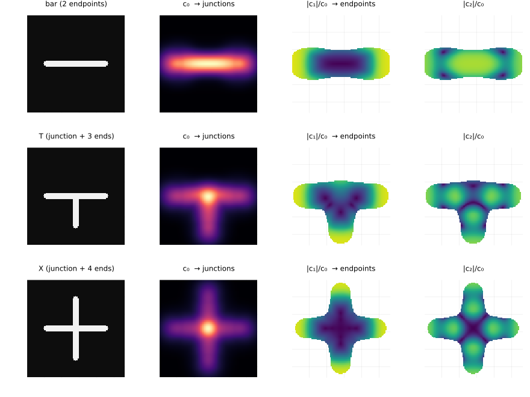
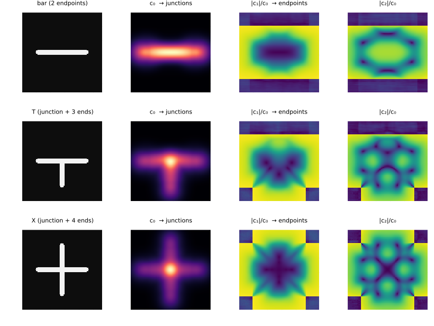

# Keypoint & shape-descriptor diagnosticity — findings

*A record of experiments testing whether local Gabor/ray-harmonic keypoints and
global shape harmonics are **diagnostic of letter identity**, and how the way
you use the keypoints changes the answer. Companion to the interactive notebook
`KeyPointDiagnosticity.jl`, which reproduces every variant below.*

---

## The question

Each letter yields two kinds of description from the ray-harmonic pipeline
(`ray_fpe_junctions.jl` / `EMNIST_Junction_Keypoints.jl`):

- **local keypoints** — points where the ray profile is distinctive
  (endpoint / corner / T-junction / X-crossing), each carrying the continuous
  signature `(c₀, |c₁|/c₀, |c₂|/c₀)`;
- **global shape** — the first rotation-invariant angular harmonics
  `|Mₙ|/M₀` of the mass distribution about the centroid.

Are these diagnostic of *which letter* it is? And does it matter **how** we turn
the keypoints into a feature vector?

## Method

- **Data:** 360 real EMNIST instances, 12 classes (`O C I L T X K A H Y E F`),
  up to 30 each, upsampled 28→112.
- **Descriptor:** a fixed-length vector per instance = *local part* (varies by
  experiment) + a *shape part*. The results table uses the four shape harmonics
  `|M1..4|/M0` throughout for comparability; the "Improving the shape descriptor"
  section below shows that extending to `|M1..6|` and adding the radial profile
  does better.
- **Diagnosticity, per feature:** η² = fraction of that feature's variance
  explained by letter identity (between-class ÷ total). 1 = perfectly
  diagnostic, 0 = within-class spread swamps it.
- **Diagnosticity, whole set:** leave-one-out **nearest-class-mean** accuracy
  on the standardized vector. Chance = 1/12 = **8.3 %**. (A deliberately weak,
  unweighted classifier — so these numbers are a *floor* on the information, and
  a noisy feature can actively *hurt* by diluting good dimensions equally.)

---

## Detectors tried

| detector | what it does | verdict |
|---|---|---|
| **greedy top-N + NMS** | repeatedly take the global max of `c₀`, suppress a disk, repeat | **tiles the `c₀` ridges**; saturates at its cap (returned exactly 12 on all 360 images → `n_kp` carries zero information); misses weak endpoints |
| **clear local maxima** | strict 8-neighbour maxima of `c₀` above `frac·max` | few and stable (~4–15); the current notebook detector. Misses stroke tips that are *shoulders* not peaks |
| **two-channel** | junctions = strong `c₀` maxima with ray-count ≥ 2.5; endpoints = maxima of the asymmetry field `\|c₁\|/c₀` on the stroke | principled (propose≠classify), but the endpoint channel is defeated by background asymmetry — see below |
| **branch-profile** (newest) | one min-gated detector for *all* types: branches = angular maxima of `B_φ(p) = min(E_θ(φ)(p), E_θ(φ)(p+d·u(φ)))`; type = branch count + angles | 7/7 on synthetic with zero calibration; **first sane endpoint counts on real EMNIST**; best local-only LOO (24.2 %). See its own section below |

### What "two-channel" means

The greedy and clear-local-maxima detectors pull *every* keypoint out of the
single `c₀` map. The two-channel detector instead searches **two different
fields**, because endpoints and junctions live in different signals:

- **Junctions (T, X) are peaks of `c₀`.** More branches meet there, so the
  ray-energy sum is highest — easy to find as `c₀` maxima.
- **Endpoints are *not* `c₀` peaks.** `c₀` only rises to a *shoulder* at a stroke
  tip (it keeps climbing inward toward the junctions), so a `c₀`-maximum detector
  structurally misses them. But an endpoint *is* the peak of the **asymmetry**
  field `|c₁|/c₀`, which → 1 where a single uncancelled ray leaves the point
  (exactly a stroke end) and → 0 mid-stroke.

| channel | field it searches | what it finds |
|---|---|---|
| junction channel | `c₀` local maxima, ray-count ≥ 2.5 | T / X |
| endpoint channel | `\|c₁\|/c₀` (asymmetry) maxima on the stroke | endpoints |



*The two channels, on synthetic figures (**background masked out** of the ratio
maps — see the caveat below). **`c₀`** (magma) has a bright **peak at the junction
centre** of the T and X — and none on the bar, which has no junction. **`\|c₁\|/c₀`**
(viridis) does the opposite: it lights up at the **arm tips (endpoints)** and goes
dark at the junction centre and mid-stroke. So a `c₀`-maximum detector finds
junctions but misses ends, while the asymmetry field finds ends — hence two
channels. (`\|c₂\|/c₀`, straightness, is shown for completeness: high along a
straight stroke, low at junctions and corners.)*

The mask above is **misleading if left unexplained** — here are the *same* ratio
maps with the background left in:



*Unmasked, **`\|c₁\|/c₀` is bright (≈ 1) throughout the background** surrounding the
figure — looking just like endpoints everywhere.* This is not noise (both `c₁` and
`c₀` are radius-`D_RAY` ring integrals, so the maps are smooth). It is a real
effect of the ray construction: far from the figure, the ring of radius `D_RAY`
clips the ink on a **narrow, one-sided arc**, so all the rays that see anything
point roughly one direction (toward the figure). One-sided rays = maximal
asymmetry = `|c₁|/c₀ → 1` — the *same* signature a true endpoint produces (one
uncancelled ray). So in the background the asymmetry field is **indistinguishable
from a real stroke end**. The mask in the first figure is a *display convenience*
(it hides where the ratio is meaningless because `c₀` is near zero); it is **not**
part of the detector. And this same background-asymmetry effect is exactly what
**defeats the endpoint channel on real data** — a `|c₁|/c₀` maximum just past a
real tip is out-competed by the even-higher background asymmetry beyond it (see
the endpoint-detection section).

The two lists are then merged. The name just contrasts with the *single-channel*
greedy and local-maxima detectors. It borrows *propose ≠ classify* from the
`Dense_Gabors` feature layer: different feature **types** get their own detection
operation. The catch (see the synthetic section) is that the endpoint channel
fails even on clean figures — just past a real tip the *background* asymmetry is
also ≈ 1, so the tip is not a strict local maximum of `|c₁|/c₀`.

## Ways of *using* the keypoints

| encoding | local feature vector | rationale |
|---|---|---|
| **mean-pool** | `[n, flatness, mean\|c₁\|/c₀, mean\|c₂\|/c₀]` | pool the signature over all keypoints |
| **typed counts (2-D)** | `[n_end, n_cor, n_T, n_X]` via nearest canonical signature in `(\|c₁\|/c₀, \|c₂\|/c₀)` | count keypoints of each type |
| **typed counts (ray-count)** | same, but nearest in 3-D `(n_rays, \|c₁\|/c₀, \|c₂\|/c₀)` with `n_rays = 2·c₀/median-on-stroke` | ray count is the primary type discriminator |
| **two-channel counts** | `[n_end, n_T, n_X]` straight from the two-channel detector | endpoints from asymmetry, junctions from strong `c₀` |

---

## Results

Leave-one-out accuracy (12 classes, chance 8.3 %):

| # | detector + local encoding | local-only | **full (+harmonics)** |
|---|---|---|---|
| 1 | greedy + mean-pool | — | **57.8 %** |
| 2 | clear local maxima + mean-pool | — | 54.7 % |
| 3 | clear local maxima + typed counts (2-D) | 16.7 % | 51.7 % |
| 4 | clear local maxima + typed counts (ray-count) | 16.7 % | 49.4 % |
| 5 | two-channel + typed counts | 18.9 % | 53.6 % |
| — | **shape harmonics only** | — | **57.2 %** |

Per-feature η² (shape harmonics are stable across every run):

```
|M3|/M0  0.64      |M2|/M0  0.62      |M4|/M0  0.62      |M1|/M0  0.36
flatness 0.41      (typed counts, best case)  n_T 0.31 / n_X 0.23
```

### Reading the table — the three headline findings

1. **The global shape harmonics carry the letter identity.** Alone they reach
   **57.2 %** (≈ 7× chance), and `|M2|,|M3|,|M4|` are the most diagnostic single
   features in every run. `|M2|` = elongation (I/L high, round O/C low),
   `|M3|` = 3-foldness (T/Y high).

2. **The local keypoint features, as encoded here, do not help — and can hurt.**
   Local-only accuracy is 16–19 % (barely 2× chance), and the *full* set never
   beats harmonics-alone: adding the local dimensions to the unweighted
   nearest-mean classifier drags 57.2 % down to 49–54 %. (With a weighted or
   learned classifier the "hurt" would vanish; "adds little" is the robust
   claim.)

   **Why "full" can score *below* "shape-only" — it's the classifier, not the
   data.** Adding features cannot remove information, so this is an artifact of
   nearest-class-mean. It works on **standardized** features and equal-weighted
   Euclidean distance, so *every* feature gets the same vote regardless of how
   diagnostic it is. A noisy local dimension (η² ≈ 0.15) then adds roughly the
   same random spread to *every* class's distance as a good shape harmonic
   (η² ≈ 0.6) adds useful separation; when the shape features separate the true
   class from a rival by only a slim margin, that added noise flips some
   nearest-class assignments — the classic distance-classifier "dilution" by
   irrelevant features (add three coin-flippers to a close four-vote decision and
   they can overturn it). A classifier that *learns* feature weights (LDA,
   logistic regression, diagonal QDA) down-weights the noisy dimensions, so
   adding them is at worst neutral. Demonstrated directly on the two-channel run:
   weighting each standardized feature by its η² turns the full-set result from
   **53.6 % → 61.4 %**, now *above* shape-only — same features, same classifier,
   just not equal-weighted. So the robust, classifier-independent readouts are the
   **per-feature η²** and the **shape-only** accuracy, not the ranking of full
   vs. shape-only.

3. **"Cleaner" keypoints made the *pooled* features *less* diagnostic.** Going
   greedy → clear-local-maxima dropped the mean-ratio η² (`mean|c₁|/c₀`
   0.38 → 0.19) and overall accuracy (57.8 → 54.7 %). Not because the keypoints
   are worse — they're more meaningful per point — but because a **mean over
   ~5 points is noisier than a mean over ~12**. The greedy's dense ridge-tiling
   was accidentally a better *texture* statistic. Lesson: don't average a
   handful of points.

### Improving the shape descriptor: higher moments help

The baseline shape descriptor used only the first four angular harmonics
`|M1..4|/M0`. Two cheap extensions both help (shape-only LOO, 30 instances/class):

| shape descriptor | LOO |
|---|---|
| angular `\|M1..4\|` (baseline) | 57.2 % |
| angular `\|M1..6\|` | 58.6 % |
| angular `\|M1..8\|` | 58.6 % (plateaus) |
| angular `\|M1..4\|` + **radial profile** | **60.8 %** |

- **Higher angular moments carry real signal**, not noise: `|M5|` η² = 0.54,
  `|M6|` = 0.46 — comparable to `|M1|` (0.36). Extending to `|M1..6|` gains ~1.4 %;
  beyond 6 it plateaus.
- **The radial mass profile** (mass at each normalised radius about the centroid —
  filled vs. hollow) is a *complementary* axis the baseline ignored. On its own it
  is weak (~28 %, still 3× chance), but added to the angular harmonics it lifts the
  total another ~2 %. The notebook's default shape descriptor is
  `angular |M1..6| + radial`.

### The ray-probe scale is the endpoint lever

Everything ran at a single ray-probe radius `D_RAY = 15`. Sweeping it on the clean
synthetic figures shows the choice matters **almost entirely for endpoints**:

```
figure       D_RAY=8       D_RAY=15 (baseline)   D_RAY=20     (ideal endpoint: nr 1, |c1|/c0 1)
             nr  |c1|/c0    nr   |c1|/c0          nr   |c1|/c0
endpoint    2.14  0.26     1.5   0.55            1.14  0.81    ← recovers toward ideal
straight    2.0   0.0      2.0   0.0             2.0   0.0
L-corner    2.97  0.28     2.45  0.51            2.14  0.63
T-junction  3.28  0.19     3.2   0.30            3.1   0.33
X-crossing  3.82  0.0      4.21  0.0             4.17  0.0
```

An endpoint's single uncancelled ray only reads cleanly once the probe **clears
the stroke width** — at `D_RAY = 20` its signature is near-ideal (nr 1.14,
`|c₁|/c₀` 0.81) versus near-broken at 15 (nr 1.5, right at the detection
threshold). Junctions (T/X) are **scale-stable**. So a larger probe scale — or a
2–3 scale stack, giving each keypoint a multi-scale signature (the handoff doc
§7.4 "a curve drifts across scale, a corner stays put") — is the lever for the
endpoint channel. Caveat: on real letters a larger `D_RAY` also raises cross-talk
between nearby strokes, and this fixes the *signature at a known point*, not the
detection-against-background confound. The notebook exposes `D_RAY` as a slider.

### Phase — an additional channel, not a replacement (handoff doc §9)

Everything above uses the **energy** (modulus) of the ray profile, which is
phase-invariant by design. What does the **phase** carry? We built a parallel
descriptor: sample the *unit phasor* `e^{i·phase}` along the rays and take its
circular harmonics `pₙ` (so `|p₀|` = phase coherence around the ring, `|p₁|,|p₂|`
its angular variation), then pooled `|p₀|,|p₁|,|p₂|` over the keypoints.

**For letter identity, phase is weakly diagnostic and does not help.**

```
per-feature η²:  |p0|=0.12   |p1|=0.26   |p2|=0.22       (shape harmonics ≈ 0.6)
LOO:  phase-only 18.8 %   shape-only 62.1 %   shape+phase 61.3 %
```

It carries *some* signal (`|p₁|` η²=0.26, phase-alone 2.3× chance) — and notably
more than the naive winning-θ phase read at a single point (η²=0.05), so taking
harmonics of the *profile* does extract structure a point-sample misses. But it
is far below shape and does not add to it (the same equal-weight dilution). `|p₀|`
is only ~0.3 for every letter, because the ring samples both on-stroke (bar phase)
and off-stroke (near-random phase) points, so ring-coherence is low and
non-class-specific.

**Where phase *does* earn its keep — junction verification, which energy cannot
do at all.** On synthetic figures with controlled polarity (center signature):

```
figure                         c₀     |c₁|/c₀ |c₂|/c₀ |  |p₀|  |p₁|  |p₂|
same-pol X (4 bright arms)      15.4   0.00   0.00    |  0.37  0.16  0.05
OPP-pol crossing (bright ⟂ dark) 15.5  0.01   0.01    |  0.43  0.36  0.15
straight bright bar             7.4    0.00   0.89    |  0.46  0.44  0.31
straight dark bar               7.4    0.00   0.89    |  0.46  0.44  0.31
```

Energy is **blind to polarity**: the same-polarity X and the opposite-polarity
crossing are identical in `(c₀,|c₁|/c₀,|c₂|/c₀)`, and a bright bar equals a dark
bar exactly. The **phase harmonics break that degeneracy** — same-pol vs opp-pol X
differ 2.3× in `|p₁|` (0.16 vs 0.36); for a T the `|p₀|,|p₁|` signature nearly
swaps. And with the right invariance: bright and dark *straight* bars give
identical `|pₙ|` (phase is blind to a global contrast flip) but *relative* branch
polarity at a junction is visible. This is exactly the `CreateTJunctionLifting`
phase-compatibility axis — telling a genuine same-ink junction from an accidental
opposite-contrast crossing.

**Conclusion:** keep energy as the *primary* channel (phase-invariant, it's what
carries identity). Phase is a useful *additional* channel for **verification /
scene-parsing** (rejecting accidental crossings, line-vs-edge polarity), not for
clean single-letter identity, where it's marginal. On EMNIST — all strokes one
ink — there are no opposite-polarity crossings to reject, so the verification gain
is latent until the input is more than isolated same-ink letters.

### Endpoint detection — a deep dive, and a nonlinearity lesson

Endpoints are the channel that failed in every energy-based attempt (asymmetry
`|c₁|/c₀` confounded by background, `n_endpoint ≈ 0` on real letters). A better
model of what an endpoint *is*, physically: at a stroke tip there is a **step edge
running across the stroke** — oriented *perpendicular* to the stroke, at a scale
~the stroke width, with **odd (edge) phase**, not the even (line) phase of the
stroke body. This is the classic end-stopped / hypercomplex cell; a row of such
line-ends is what forms an illusory "virtual contour" perpendicular to the lines.

**1. The perpendicular-odd-phase signature is real** (synthetic bar with a clean
end, probing the tip vs mid-bar):

```
                    ⟂-orientation response:  energy   edgeness(|sin φ|)
tip   (small λ≈width)                          9.0     0.89   ← odd/edge
mid-bar                                        0.14    0.00   ← nothing
end score (⟂energy·edgeness), tip/mid contrast:  large λ 381×,  small λ 8·10⁶×
```

The tip has a strong odd perpendicular response; mid-bar has ~none. My earlier
"phase is minor" conclusion was wrong *for endpoints* — it came from reading the
*winning* (stroke-parallel) orientation, which is always even. Read the
*perpendicular* orientation and the odd endpoint signal is there. A **small scale**
(λ≈stroke width) localizes it cleanly (mid-bar response exactly 0, no bleed).

**2. A working detector needs three components** — each alone over-fires:

- `perp-odd-edge` ("cross-stroke edge here") — also fires at junctions;
- `× termination` ("stroke ends on one side") — also fires at corners (an arm
  ends into the other arm);
- `× single-branch` (ray-count `c₀ ≈ 1`) — rejects corners/junctions (≥2 branches).

Together, on clean **synthetic** figures this is correct: `straight → 2 tips,
T → 3 tips, X → 4 tips`, with the junction/crossing centres **rejected**. On real
EMNIST it still **over-fires** (T/Y/K hit the cap of ~10) — handwriting wobble,
curvature and thickness variation make all three per-pixel gates locally noisy.
The same clean-input-works / messy-input-fails gap as everywhere.

**3. Why not a purpose-built (non-Gabor) matched filter?** We tried: a
directional (2π) end-stopped operator — excitatory tip, inhibitory beyond and
flanks — built to match the line-end signature directly. It **traces the entire
figure-ground boundary** (the response map outlines the whole letter), not just
the ends. The lesson is fundamental: **a single *linear* filter cannot detect
line-ends**, because a linear filter on the raw image responds to *contrast* — any
boundary. To distinguish "a bar of orientation θ that *ends* here" from "any edge
here" you must first **rectify** to oriented *energy* `|Gabor_θ * I|` (a
nonlinearity); only then does end-stopping (subtract displaced energy) mean
anything. That rectification is the defining feature of an end-stopped cell, and
it is exactly why the energy-based 3-component detector got clean synthetic tips
while the linear matched filter cannot.

**Takeaway:** we are *not* limited to Gabors — the end-stopping *geometry* is free
to design (the excite-inside / inhibit-beyond-and-across shape is right). But that
shaped operator must sit on top of an oriented-*energy* front end, not the raw
image; the Gabor's only essential job is providing that rectified oriented energy.

### The branch-profile detector — min-gates for every keypoint type

The endpoint thread above ended with "the operator must sit on top of rectified
oriented energy". The next question was *which* nonlinearity. Starting proposal:
`max_φ min(E_θ(φ)(p), E_{θ(φ)+π/2}(p+d·u(φ)))` — "a line here AND a
perpendicular cap ahead". Tested on synthetic bar/plus/T/X (scores normalized
per shape, tips vs junction centre):

| variant | bar | plus | T | X |
|---|---|---|---|---|
| A `min(here, ⟂ ahead)` | tips 1.0 / mid 0.37 ✓ | tips 0.35 / **ctr 0.89** ✗ | ctr 0.80 ✗ | ctr 0.99 ✗ |
| B `min(here, [behind−ahead]₊)` same orientation | tips **1.0** ✓ | tips **1.0** / ctr 0.66 ✓ | tips 1.0 / ctr 0.94 | tips **1.0** / ctr 0.54 ✓ |
| C = B AND ⟂ cap | worse than B everywhere | ✗ | ✗ | ✗ |

**A is a *crossing* detector, not an endpoint detector** — the place with the
most perpendicular energy is precisely a junction, so gating on it inverts the
result. The discriminating operand is **termination** on the *same* orientation
(B): "line here, line behind, gone ahead". The AND (`min`) is the right
nonlinearity; the perpendicular axis was the wrong probe (re-adding it, C,
re-imports the crossing confusion). Walking B along a bar axis shows the
mechanics: the value is the min of a *rising* termination curve and a *falling*
here-energy curve, so it peaks exactly at their crossing — the tip — and the
here-energy operand vetoes the background beyond (where the old `|c₁|/c₀`
channel was fooled).

**Generalization: the branch profile.** For every 2π direction φ define

```
B_φ(p) = min( E_θ(φ)(p),  E_θ(φ)(p + d·u(φ)) )
```

— "a stroke of the *matching orientation* is here AND still there one step out
in direction φ". The min anchors it to the stroke (background-proof); the
d-offset makes π-periodic energy directional. The **angular local maxima of
`B_φ(p)` are the branches leaving p**, and the branch count + angles give the
type *structurally* — no sums, no median calibration:

| branches | angles | type | synthetic result |
|---|---|---|---|
| 1 | — | endpoint (= detector B) | bar tip ✓ |
| 2 | ≈180° | continuation — not a keypoint | bar mid ✓, circle point ✓ |
| 2 | else | L-corner | L ✓ (106°) |
| 3 | any | T / Y | T ✓, Y ✓ |
| 4 | — | X | X ✓ (45/135/225/315°) |

**7/7 correct with zero calibration** — the `nr ≥ 2.5/3.5` boundary problem
dissolves (each branch clears its own gate; nothing is summed), O's phantom
junctions vanish structurally (a curve point = 2 branches ≈180° → rejected),
and L-vs-straight becomes an *angle*, not a count.

**On real EMNIST, the gate design splits cleanly** (the recurring
clean-vs-messy gap, but this time diagnosed to the threshold):

- **absolute gate** (`B > 0.35·max E`) alone → *phantom endpoints* en masse
  (O averaged 36!): where a stroke tapers, the weaker along-stroke branch falls
  below threshold and mid-stroke pixels read "1 branch";
- **relative gate** (`B > 0.4·strongest-branch-here`) alone → endpoints become
  sane (O 0.7, C 1.3, Y 2.8 — right ordering) but weak angular noise-peaks now
  clear the gate → *phantom junctions* (O: ~21 fake T's);
- **two-gate rule** (junctions typed from the abs-gated list; endpoint iff the
  rel-gated list has *exactly one* branch) keeps the best of both.

Survey with the two-gate rule (same 12×30 protocol): per-class mean `n_end` =
O 0.3, C 1.1, I 0.9, L 1.1, T 1.9, X 2.3, K 2.8, Y 2.6, E 2.3, F 2.3 — the
**first detector whose endpoint counts are in the right ballpark with the right
ordering** on real letters. Typed-counts-only LOO: **24.2 %**, the best
local-only result of any detector (previous: 16.7–18.9 %). Still open: the
corner and T channels over-fire on real letters (O: ~21 "corners", ~11 "T"s —
curvature + wobble create genuine 2-branch-at-<150° and 3-branch pixels), and
the 2-point min probe is sensitive to stroke gaps (probing 2–3 points per ray
is the likely robustification).

Interactive companion: **`BranchProfileDetector.jl`** — per-type score heatmaps
for a slider-chosen letter (score = weakest accepted branch, i.e. the strength
of the AND), with abs/rel/d sliders, plus the η²/LOO survey.

### Multi-scale consistency — a failed `min`, then a working drift test

The corner/T over-firing pointed at the handoff doc's §7.4 principle: **a
corner stays put across scale, a curve drifts.** Two implementations, one
negative and one positive result.

**Attempt 1 — elementwise `min` over probe scales (FAILED).** Compute the
branch stack at d = 6, 10, 14 and take the pointwise min at fixed φ ("the
branch must be present at the same angle at every scale"). Three separable
effects, only one of them good:

- ✔ T/X phantoms drop (spurious third branches don't survive three scales);
- ✘ **endpoints re-break** (X-class: 2.2 → 8.3): near a junction any branch
  *shorter than the largest d* is killed, so junction-adjacent pixels read
  "1 branch" → phantom endpoints. The min conflates *"angle drifts"* (curve —
  want to kill) with *"branch is short"* (near-junction — must keep);
- ✘ corners *worsen*, and the synthetic circle point flips to L-corner: curve
  chords bend **more** at larger d (31° deficit at d = 14 on r = 26), and a
  fixed-φ min can only express "energy dropped", not "the angle moved".

**Attempt 2 — drift-aware stability (WORKS).** Extract the branch *list* at
each scale separately; a d = 6 branch is **stable** iff its angle recurs within
±15° at *both* d = 10 and d = 14. Junction/corner typing uses only stable
branches; **endpoints are decided at the smallest scale only** (structurally
immune to the short-branch failure above). Results:

- **Synthetic: 8/8**, now including a tight-curve trap (r = 12 — the
  EMNIST-curl case): its branch angles drift 21° between scales → unstable →
  correctly "continuation", where the single-scale ±30° angle test alone would
  say corner.
- **EMNIST (10/class means, drift-aware [single-scale]):** endpoints
  *bit-identical* by construction; **T phantoms cut ~3×** with sensible class
  ordering (O 3.5 [10.8], C 3.3 [11.2], K 3.5 [11.1], L 0.6 [2.7] — and L truly
  has none; A/H/E highest, as they should be); X phantoms likewise down
  (O 0.6 [2.5]).
- Two honest costs: real **X centers are under-detected** (X class: 0.7 —
  handwritten arms shorter than d = 14 fail stability and the center demotes
  to T), and **corners barely moved** (O still ~20 [22.5]).

**The corner residue has a specific suspect: outline tracing.** O's perimeter
is ~200 px and the spatial NMS keeps one keypoint per ~8 px → ~25 slots —
almost exactly the ~20 observed. A pixel on the *edge* of a thick (~10 px)
stroke sees one branch along the edge and one pointing into the stroke
interior — two stable branches at ~90° → "corner", all along the letter. If
confirmed, the fix is a *centeredness* gate (classify only near the stroke
spine), not more angle logic. Untested, alongside two other untested levers:
a **short-anchor / long-probe** split (the anchor sits at the keypoint where
structure is mixed → stubby filter; the probe sits mid-branch → elongated
filter is pure upside), and simply more envelope elongation (the current
Gabors are σ⊥ = 3, σ∥ = 6 px — aspect 2:1, but *nearly isotropic in stroke
units*, since the along-stroke support ~2σ∥ = 12 px barely exceeds the ~10 px
stroke width).

### Where this leaves the Gabor-combination programme — an honest tally

State of each channel after all of the above:

| channel | state |
|---|---|
| endpoint | **works at the count level** (two-gate rule, smallest scale): O 0.7, C 1.3, Y 2.8 — right ballpark, right ordering |
| T | phantom rate cut 3×, ordering sensible, absolute counts still ~2–4 too high |
| X | detectable, but the stability requirement trades against short handwritten arms |
| corner | **unsolved** — suspected outline artifact, plus a genuine problem: corner-vs-curve in handwriting is a *continuum*, and any binary detector will thrash at that boundary |

Three structural lessons survived every experiment: (1) **rectification first**
— no linear filter combination can detect termination; (2) **conjunctions must
be gated (`min`), not summed** — sums let evidence trade against absence;
(3) **each question needs its own gate and scale** — abs for junctions, rel
for endpoints, small d for endpoint locality, angle-stability for curvature.

But lesson (3) is also the worry, and it is worth stating plainly: every leak
so far has been plugged with *one more gate*, and real handwriting has found
the next leak every time. Two readings. (a) Keep going — the remaining corner
problem is *diagnosed, not mysterious*, and one more gate (centeredness) may
close it. (b) The hard-typing approach itself is the problem: the detector is
being asked to make discrete symbolic decisions (corner! endpoint!) at exactly
the points where handwriting is continuous, so the errors concentrate at the
category boundaries by construction. On reading (b), the way out is to stop
typing at detection time: keep the keypoint **soft** — carry the continuous
branch profile `B_φ` (or its stable-branch spectrum) bound to
centroid-relative position, and let the *classifier* draw the category
boundaries where the data puts them. That converges, from a different
direction, with what the survey results have said all along: hard counts cap
out (~24 %), configuration is where the identity lives, and η²-weighting beats
equal-weighted hard features.

### Why typed counts are inherently weak

A count is a **census** ("1 junction, 2 endpoints"). T, Y and F share roughly
the same census; O and C are both corner-loops. The counts discard *where* each
keypoint sits — and that **configuration** is what separates the letters. So the
weakness of typed counts is expected, and it points directly at the next step:
**bind each keypoint to its position relative to the centre of gravity** and use
that, rather than the bare census.

### The "O has no strong maxima" intuition — right in spirit, wrong metric

A raw count says the opposite: O averages **14.4** local maxima, the *most* of
any class, because a near-uniform `c₀` ring throws off many co-equal bumps. The
intuition lives in two *other* features: O has no *dominant* keypoint
(`flatness` is high) and is nearly rotationally symmetric, so **all** its shape
harmonics are near zero (0.04 / 0.17 / 0.07 / 0.05 — the lowest of any class).
`flatness` cleanly splits smooth letters (O/C/I/L, 0.14–0.18) from junction
letters (T/X/K/A/H/Y/E/F, 0.05–0.08).

---

## Is it the detector or the handwriting? — synthetic validation

Running the pipeline on **clean synthetic** endpoint / straight / L / T / X
figures separates "the method is wrong" from "handwriting is too messy":

**The signature (raw harmonics) is correct** — the ray count is monotonic and
near-ideal, ratios attenuated by the known form factor but patterned, matching
the handoff doc §5 reference numbers:

```
figure       n_rays        |c1|/c0        |c2|/c0
endpoint     1.5  (1)      0.55  (1.0)    0.60  (1.0)
straight     2.0  (2)      0.00  (0.0)    0.89  (1.0)
L-corner     2.45 (2)      0.52  (0.71)   0.04  (0.0)
T-junction   3.2  (3)      0.30  (0.33)   0.26  (0.33)
X-crossing   4.2  (4)      0.00  (0.0)    0.00  (0.0)
```

**But the detector is miscalibrated even on clean figures**, for two specific,
fixable reasons:

- **Type boundaries were set to ideal integers (2.5 / 3.5)** while real
  responses are attenuated: L reads 2.45 (crosses 2.5 → mis-counted as a
  junction), T reads 3.2 (median calibration pushed it over 3.5 → typed X). Fix:
  set boundaries from the *measured* clean values (≈ 1.75 / 2.7 / 3.7). The
  junction (T/X) channel is one recalibration from correct.
- **The endpoint channel fails even on a clean bar.** `|c₁|/c₀` at an endpoint
  is only ~0.55 (form-factor attenuation), and it is *not* a local maximum of
  the asymmetry field because just past the tip the one-sided **background**
  asymmetry is even higher. "Local max of `|c₁|/c₀`" therefore cannot isolate
  endpoints; the channel needs redesigning around the **1-ray `c₀` level**
  (endpoints have ~half the mid-stroke `c₀`), restricted to on-stroke pixels.

So the earlier EMNIST failures were **both** handwriting messiness **and** a
genuinely miscalibrated detector — and the synthetic test proves the detector
part is real and fixable, while the underlying representation is sound.

---

## Conclusions

- **Shape harmonics work** and are the current workhorse for identity — 57.2 %
  with `|M1..4|`, ~61 % once extended to `|M1..6|` + the radial profile.
- **Local keypoint *counts* are the wrong local representation** — identity is in
  keypoint *configuration* (type × position), not the census. The next step is
  centroid-relative position binding, not more count-tuning.
- **The detector is the bottleneck**, and it is broken in *specific, diagnosed*
  ways (junction-boundary calibration; the confounded endpoint channel), not
  hopelessly. Fixing it is a prerequisite for the position step to pay off.
  **Update:** the branch-profile detector resolves the calibration problem and
  the endpoint channel (24.2 % local-only, sane endpoint counts); the remaining
  bottleneck is corner/T over-firing on curved, wobbly strokes.
- Encoding choice matters as much as the detector: sparser/typed features carry
  less in an unweighted classifier than dense pooled ones, purely from sample
  count.

## Open next steps

1. ~~Recalibrate junction boundaries / rebuild the endpoint channel~~ **Done —
   superseded by the branch-profile detector** (see its section): min-gated
   directional branches, two-gate rule, 7/7 synthetic, 24.2 % local-only.
   T-phantoms since cut 3× by the drift-aware stability test (8/8 synthetic).
   What remains: the corner channel — test the outline hypothesis
   (centeredness gate) — or drop hard typing altogether and carry the soft
   branch profile per keypoint (see "Where this leaves the Gabor-combination
   programme").
2. **Add centroid-relative position** `(r, α)` to each keypoint and encode the
   *configuration* (e.g. FPE binding `type ⊗ position`, per the handoff doc),
   not the count.
3. **Add ray-probe scale(s)** — at minimum bump `D_RAY` toward ~20 for the
   endpoint channel; better, keep a 2–3 scale stack so each keypoint carries a
   multi-scale signature (curve-drifts-vs-corner-stays).
4. **Adopt the improved shape descriptor** (`|M1..6|` + radial) as the default,
   and test with a **weighted/learned** classifier (LDA or better) so noisy local
   dimensions are down-weighted rather than diluting the shape features equally.

*All numbers here are from the fast ray-harmonic pipeline (verified against the
naive loop to 2·10⁻⁶ in the interior). Reproduce any row with
`KeyPointDiagnosticity.jl`.*
