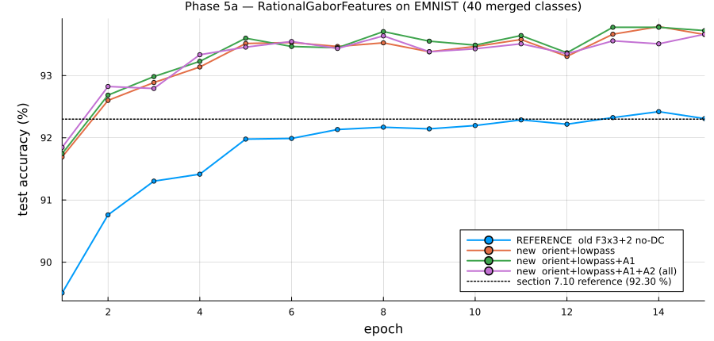

# P0-8_RationalGaborFeatures

A **bio-inspired early-vision front end**: a dense oriented-energy stack with pointwise
conjunctions, applied before any spatial pooling.

Nothing here imports EMNIST. The scale ladder is *derived from the data* by
`radial_spectrum` + `scale_ladder`, so retargeting to another dataset means re-running two
functions, not editing constants.

## Which files open in Pluto

| file | kind | |
|:--|:--|:--|
| `GaborStack.module.jl` | **plain module** | ⚠ do not open in Pluto |
| `AndLayer.module.jl` | **plain module** | ⚠ do not open in Pluto |
| `Stimuli.module.jl` | **plain module** | ⚠ do not open in Pluto |
| `Pooling.module.jl` | **plain module** | ⚠ do not open in Pluto |
| `Validate_GaborStack.jl` | **Pluto notebook** | ✅ |
| `Validate_AndLayer.jl` | **Pluto notebook** | ✅ |
| `Validate_Pooling.jl` | **Pluto notebook** | ✅ |
| `Validate_i1D.jl` | plain script — gate only, no notebook | ✅ |
| `GaborStackGPU.module.jl` | **plain module** | ⚠ do not open in Pluto |
| `Validate_GPU.jl` | plain script — gate only, no notebook | ✅ |

The four modules are `include`d and `using`-ed by the notebooks, so they must stay plain
`.jl` — a Pluto notebook cannot supply `module … end`. **Opening a plain module in Pluto
rewrites the file and leaves a `<name> backup 1.jl` beside it.** Each one carries a marker
comment on its first line as a reminder.

The notebooks also run headless as gates, and `Validate_i1D.jl` only does:

```bash
julia --project=. P0-8_RationalGaborFeatures/Validate_GaborStack.jl
julia --project=. P0-8_RationalGaborFeatures/Validate_AndLayer.jl
julia --project=. P0-8_RationalGaborFeatures/Validate_Pooling.jl
cd P0-8_RationalGaborFeatures && julia --project=.. Validate_i1D.jl   # exits 1 on failure
cd P0-8_RationalGaborFeatures && julia --project=.. Validate_GPU.jl   # skips cleanly with no CUDA
```

**`Validate_i1D.jl`** tests the criterion the whole conjunction layer rests on — Zetzsche & Barth
(Vision Research 30:1111–1117, 1990) prove no linear filter can be i2D-selective, and require the
quadratic kernel to vanish on collinear frequency pairs. It found A₁ leaking 4.6 × 10⁻² of its
crossing response on exactly-i1D input at ρ = 2, from the ±45° channel pair rather than the 90°
partner. **That is now fixed**: `a1_maps` subtracts the closed-form i1D floor by default and the
gate passes at 9.1 × 10⁻⁴. Run `I1D_FLOOR=none` to see the original operator still fail — kept
runnable because that failure is the evidence for the change.

**`Validate_GPU.jl`** asserts the CUDA path matches the CPU reference: oriented energy to
1.4 × 10⁻⁵, A₁ to ~1 × 10⁻⁵, A₂ to 2.5 × 10⁻³, and zero pixels differing by more than 5 % of RMS
so the winner-take-all tie-break provably agrees. It exits 0 with a message when there is no GPU.
The CPU path stays the reference — CUFFT's rounding is not FFTW's, so the GPU path cannot inherit
claims like "bit-identical on EMNIST".

## Design, and the measurements behind it

**Filters are built in the frequency domain** as one-sided (analytic) bumps. There is no
spatial kernel to truncate, the bank is size-agnostic, and even/odd quadrature is exact —
so `|·|²` is the complex-cell energy and **polarity invariance is exact, not approximate**.

**log-Gabor by default.** Zero DC exactly (`log 0 = −∞`), and bandwidth freedom decouples
the spatial envelope from the wavelength. That decoupling is what lets a filter tuned to a
coarse wavelength still localise finely — `σ_x = 7.6 px` at `λ = 16 px` against a 12.7 px
stroke — and it is what makes end-stopping viable at all on 28×28 images.

**The ladder comes from EMNIST's measured spectrum**, not from convention: 94 % of the
energy sits at `λ ≥ 8 px` (112-grid) and only 3.9 % above `ρ = 8`. Hence
`ρ = 2.00 / 3.74 / 7.00` → `λ@112 = 56 / 30 / 16`. For comparison, the old `Config.SCALES
= [3, 6, 12, 24]` put one channel *past Nyquist entirely* and another where ~1 % of the
energy lives.

**`dtheta_on_sigma = 0.75`, not Kovesi's 1.5.** This parameter — *not* the orientation
count — controls spatial elongation, since `σ_along = W/(2πρ₀σ_φ)` and `σ_φ = (π/n)/dts`,
so `n` cancels out of angular coverage. At 1.5 the coarse channel has `σ_along = 34 px`,
**longer than any EMNIST stroke**, so no stroke ever looks uniform and end-stopping cannot
work. The field also drops 320 → 224.

### What A₁ and A₂ actually compute

Both are evaluated **at every pixel, per scale**, and pooled afterwards. `Eₖ` is the
quadrature energy in orientation channel `k`; the `n` channels span 0–180°, so a shift of
`n/2` channels is exactly **90°**.

**A₁ — orientation-profile autocorrelation at 90° lag**

```
C₀ = Σₖ Eₖ                        total energy over orientations
S  = Σₖ Eₖ · E₍ₖ₊ₙ⁄₂₎              each channel × the one 90° away
A₁ = S / C₀
```

With `pₖ = Eₖ/C₀` the normalised profile this is `A₁ = C₀ · Σₖ pₖ pₖ₊ₙ⁄₂` — the profile's
autocorrelation at 90° lag, multiplied back by `C₀`. Large only where two perpendicular
orientations are present **at the same point**. The `C₀` factor converts a dimensionless
shape measure into an energy, which is what makes a spatial mean of it meaningful and makes
`0` the correct value where there is no energy.

**A₁ cannot count rays.** The orientation profile is π-periodic, so a T-junction and an
X-crossing have identical content `{0°, 90°}`. Ray count is a 2π property, which is why
`RayHarmonics` exists.

**A₂ — end-stopping along the stroke**

At each pixel take the **locally dominant** orientation channel; its carrier is `θ_c`, so the
stroke runs along `θ_s = θ_c + 90°`. Probe that same channel a distance `d` each way *along*
the stroke:

```
E₊ = E(x + d·u(θ_s))              bilinear
E₋ = E(x − d·u(θ_s))
A₂ = E(x) · |E₊ − E₋| / (E₊ + E₋ + κ·E(x))          κ = 0.5
```

A stroke that continues both ways gives `E₊ ≈ E₋` and `A₂ ≈ 0`; at a line end one side has
energy and the other does not. The offset `d` is `d_factor · imwidth/(2πρσ_φ)` under the
default `:envelope` anchor — 17.0 / 13.6 / 9.7 px on a 112 px image.

Three details in that formula were each a bug once:

* **dominant orientation, not max over orientations** — the max version gave 2.5×
  end-versus-interior, the dominant-channel version gives **10.4×**;
* **`κ·E(x)` is relative conditioning** — an absolute ε there collapsed A₂ to plain energy;
* **the leading `E(x)`** makes A₂ an energy rather than a bare ratio, which is why mean
  pooling is valid for it and why it needs none of the ratio-after-pooling treatment the ray
  harmonics do.

**The AND layer is the point.** Multiplication and pooling do not commute; their difference
is the within-window covariance `Cov_x(e₁,e₂)`, which *is* the co-location signal. No
statistic of already-pooled orientation energy can represent it — including a
Squeeze-and-Excitation gate, which multiplies whole channels by scalars derived from
*global* average pooling and so has no spatial resolution at all.

## Measured

All on synthetic stimuli with known ground truth. **These are the *dense* maps** — see the
caveat below, which matters.

| | |
|:--|--:|
| A₁ at a junction, crossing vs separated bars | 10.3× / 7.1× / **17.6×** |
| A₁ across the gap sweep | 1.00 → **0.06** |
| …while pooled orientation energy | 1.00 → **0.97** |
| A₂ end/interior, finest scale | **10.4×** |
| A₂ end/flank · end/blob | 4.4× · 4.8× |

### Two corrections to earlier versions of this file

**A₁ does *not* order junctions by ray count.** An earlier version reported straight 6.3e4
< L 9.5e4 < T 1.15e5 < X 1.58e5 as an unprompted result. That tracks **total ink**
(980 / 1052 / 1359 / 1708 px). Normalised by energy the ordering breaks — L-corner 0.0415
outranks T-junction 0.0391 — and with ink held constant a T and an X give 1.15e5 against
1.16e5.

The theory says it must be so: A₁ is built on the orientation profile, which is
**π-periodic**, and ray count is a **2π** property. A T and an X have identical orientation
content, {0°, 90°}. What A₁ separates is one orientation (0.029) from orientations
*meeting* (0.039–0.044) — **i2D-ness, not junction order**. Since `F` has a 3-ray T and `f`
a 4-ray X, **A₁ was structurally the wrong operator for the case that motivated it.** The
operator for ray count is `c₀` from the ray transform in `P00_New_Gabor_FPE/`, which is 2π by
construction because its `d`-offset makes east and west read different pixels.

**The numbers above are dense-map contrasts; the classifier sees pooled ones.** Pooling at
3×3 costs about 4×:

| | dense | **pooled (what the MLP sees)** |
|:--|--:|--:|
| A₁, junction vs separated | 17.6× | **4.9×** |
| A₂, end vs interior | 10.4× | **2.6×** |

Still a real contrast, but the gates were validating the *operator* rather than the
*feature*. Blur turns out to be nearly irrelevant by comparison: at EMNIST's measured edge
profile (49 % mid-tone ink, 8.2 px transition) the pooled A₁ contrast is **5.0×**, i.e.
unchanged from sharp-edged stimuli.

## Pooling comes last

`select → multiply → pool` — simple cell → complex cell, and conv → ReLU → pool. **Detect,
then tolerate.** Pooling is not the enemy; pooling *first* is. The old Fourier grid pooled
via its Gaussian window and only then combined orientations into `|E₄|`, and no downstream
capacity can undo an averaging that has already happened.

Measured: a 4 px shift (about a third of a stroke width) leaves the 3×3 vector at
**cos = 0.998**, against 0.995 at 6×6 and 0.994 at 11×11 — finer grids keep more detail and
tolerate less, which is the trade the grid parameter prices.

Default feature vector, `grid = 3`, blocks `(:orient, :lowpass, :A1, :A2)`:

| block | columns | |
|:--|--:|:--|
| `:orient` | 135 | orientation harmonics of the **pooled** energy — the deficient baseline |
| `:lowpass` | 9 | |
| `:A1` | 27 | conjunction computed pointwise, **then** pooled |
| `:A2` | 27 | end-stopping, likewise |
| **total** | **198** | |

Every ablation arm has a `shuffle_block!` twin, which permutes a block's rows across
samples — same marginals, same column count, correspondence destroyed. §7.8 showed a fixed
projection into a few hundred dimensions plus a trained head reaches 75 % *whatever the
projection is*, so without that control "A₁ helped" and "27 more columns helped" are
indistinguishable.

## Extraction cost

**20.9 ms per image**, so the full 131,600-image split takes about **6 minutes** on 8
threads. `energy_stack` is 16.4 ms of that and sits at the FFT floor; the conjunctions are
1.9 + 2.2 ms.

Getting there took two fixes worth remembering, both worth 10× or more and neither visible
in any output:

* the AND loops iterated **pixel-outer with the channel as the last array index**, so every
  channel access strided 12,544 floats and missed cache — 190 ms for A₁ against 8 ms for
  the same arithmetic channel-outer;
* `bank.meta` is a `Vector{NamedTuple}` (abstract), so `m.theta` returned `Any` and made
  every `@view E[:,:,that]` type-unstable — another 8× on top. `scale_channels` now
  annotates its return type.

## Phase 5a — EMNIST

`Phase5a_EMNIST.jl`, full official split, 40 homoglyph-merged classes, the section 7.10
classifier unchanged (`Dense(n=>256,relu) → Dense(256=>40)`, Adam 1e-3, batch 128, 15
epochs, seed 1).

**The reference arm came first**, and it landed exactly: the old F3×3+2 no-DC features,
re-extracted and re-trained in this harness, give **92.30 %** against the 92.30 % recorded
in section 7.10. The harness is sound, so the rest of the table can be read.

| arm | n | final | best |
|:--|--:|--:|--:|
| reference — old F3×3+2 no-DC | 88 | 92.31 % | 92.42 % |
| new: `orient` + `lowpass` | 144 | **93.71 %** | 93.78 % |
| + `A1` | 171 | 93.78 % | 93.78 % |
| + `A1` + `A2` | 198 | 93.71 % | 93.71 % |



**The new front end is worth +1.40 points** over the old features — about 8 standard errors,
so real. That gain comes from the bank itself: a scale ladder placed on the measured
spectrum, more orientations, correct padding.

**The AND layer adds nothing: +0.07 for A₁, and −0.12 once A₂ joins it.** This is the
layer the whole design argument was built around, and on this task it does not pay.

### …but not because it fails to compute anything

Each block trained alone:

| block alone | n | accuracy |
|:--|--:|--:|
| `orient` | 135 | 93.59 % |
| **`A1` + `A2`** | **54** | **88.45 %** |
| `A2` | 27 | 78.27 % |
| `A1` | 27 | 75.63 % |
| `lowpass` | 9 | 62.15 % |

**54 conjunction features alone reach 88.45 %.** They are strongly informative, so the
right word is **correlated**, not redundant. Phase 3 proves A₁ and orient compute different
things — on stimuli where pooled orientation gives cos 0.97, A₁ separates by 4.9× pooled.
What Phase 5a measures is only that A's *marginal* contribution given orient is ~0 on this
data, which is a much weaker statement than "A is a function of orient".

Three things could each produce that, and aggregate accuracy cannot separate them: high
correlation across EMNIST specifically; the decisive configurations being rare; or A being
a noisier estimate of a partly shared signal. Note the ceiling — `F`/`f` is 17.3 % of
*errors* but only **1.3 % of test items**, so perfectly solving it caps the gain at +1.34
points, and a partial improvement on a 1.3 % subset against a 0.19 % standard error is
unmeasurable in aggregate. Adding A did in fact remove **8 of 251** `F`/`f` errors.

That is the outcome the theory should have predicted, and did, before a confusion analysis
talked us out of it. At a fixed spatial resolution the orientation profile is fully
described by its harmonics, and products of energies are functions of that same profile;
the non-commutation of multiply and pool only buys something when there is sub-cell
structure the covariance can see *and* the classes actually depend on it. On EMNIST the
second condition fails.

### The targeted check agrees

Errors on the pairs the confusion analysis said A₁ should fix:

| pair | old | new | new + AND |
|:--|--:|--:|--:|
| **F / f** | 251 | 265 | 257 |
| 0 / D | 37 | 32 | 28 |
| T / t | 34 | 27 | 33 |
| 4 / Y | 30 | 27 | 26 |
| U / V | 26 | 26 | 27 |
| C / e | 20 | 14 | 19 |
| X / Y | 10 | 6 | 7 |
| K / h | 9 | 4 | 6 |
| **total** | **417** | **401** | **403** |

`F`/`f` — 17 % of all remaining error, and the motivating case — is **not** improved. Total
errors fall from 1,448 to 1,176, but junction-pair errors stay flat, so they *rise* as a
share of the total from 28.8 % to 34.1 %. The new bank fixes non-junction errors and leaves
the junction errors exactly where they were.

### A prediction that was wrong

Original estimate: **+0 to +0.5**, on the grounds that the task does not reward i2D
structure. Revised to **+0.5 to +1.5** after the confusion analysis showed the residual
errors were junction-distinguishable. Measured: **−0.12**.

The revision was the mistake. "Distinguishable in principle" is not "this feature adds
something", because the information was already present in another form. This is the same
error made repeatedly in this project — over-predicting that a representational addition
will pay off — and the confusion analysis, which felt like hard evidence, made it worse
rather than better.

## Results

Two write-ups:

* **[`RESULTS.md`](RESULTS.md)** — the working record, assumes familiarity with the project.
* **[`RESULTSexpanded.md`](RESULTSexpanded.md)** — **standalone**, ~930 lines, assumes no
  knowledge of the project or of computer vision. Defines every term, explains why each test
  was necessary before describing it, and gives enough detail to repeat any of them. Start
  here if you have not read the rest of this repository.

`RESULTS.md` covers Phases 5–7 in full: the EMNIST replication, the
AND-layer null and the three independent lines that establish it, the augmentation control
(the strongest positive result — augmentation buys a CNN 9–13 points and these features
nothing), the blur investigation, and three corrections to earlier claims in this file.

## Status

Phases 0–7 complete. The front end is validated, faster than the old one, and **+1.4
points better** — but its distinctive contribution, the conjunction layer, is redundant on
EMNIST rather than useful.

Open, in the order that would settle the most:

1. **Is it the pooling?** A₁ is a point property read out over 37 px cells. A finer grid for
   the A blocks alone would separate "the conjunction is redundant" from "3×3 pooling
   destroys it". One re-extraction, ~9 minutes.
2. **The shuffled-block control** is now moot for A₁/A₂ (there is no gain to attribute) but
   still wanted for the +1.40, which is 56 extra columns as well as a better bank.
3. **A binary `F`-vs-`f` probe**, run three ways — orient alone, A₁+A₂ alone, ray harmonics
   — stripping out the 40-class dilution. If A alone beats orient alone on that pair, the
   information is different and useful and merely drowned by averaging.
4. **`c₀` from the ray transform.** A₁ is π-periodic and provably cannot count rays, which
   is precisely what `F`/`f` requires. The ray transform in `P00_New_Gabor_FPE/` gets 2π
   structure from a spatial offset and is **linear in the energy field** — a simpler
   operator that captures what the bilinear one cannot.
5. **A task that requires i2D structure.** The negative is about EMNIST, not the layer:
   `A1+A2` alone at 88.45 % from 54 numbers says the signal is real.
