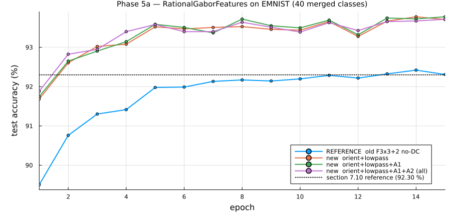
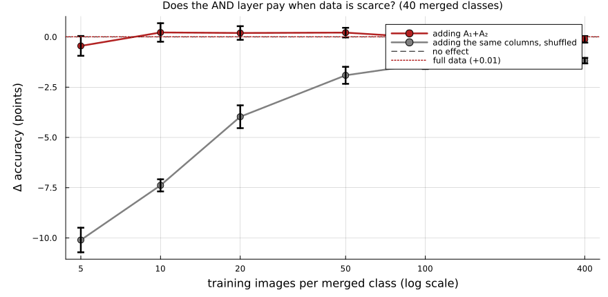
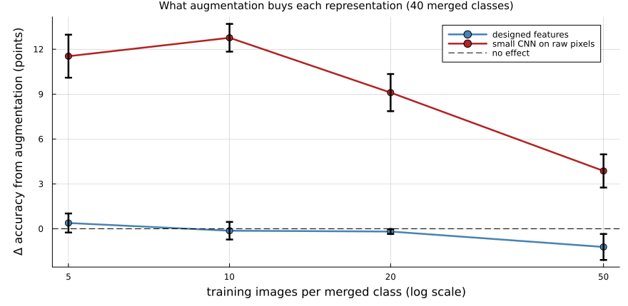

# Results — Phases 5 and 6, plus three corrections

*2026-07-28. Everything here is on EMNIST-Balanced with the 47 classes merged to 40
homoglyph classes (chance 2.50 %), official split, one hidden layer of 256, Adam 1e-3.
`README.md` in this directory covers the design; this file covers what happened when it
met data.*

**Two headline results, pulling in opposite directions.**

1. **The front end works and is worth +1.4 points** over the previous feature set — and
   Phase 6 shows it works *for the reason claimed*: augmentation buys a CNN 9–13 points
   and buys these features nothing, so they genuinely carry the invariances.
2. **The AND layer — the whole theoretical payload — adds nothing on EMNIST.** Not because
   it fails to compute, but because its contribution is already present in the orientation
   statistics for this data.

---

## Phase 5a — does the new front end reach a number we already have?

The reference arm came first, and it landed exactly: the old F3×3+2 no-DC features,
re-extracted and re-trained *in this harness*, give **92.30 %** against the 92.30 %
recorded in §7.10 of `TestFeaturesWithMLP/README_MLP_FPE_Experiment.md`. So the rest is
readable.

| arm | n | final | best |
|:--|--:|--:|--:|
| reference — old F3×3+2 no-DC | 88 | 92.31 % | 92.42 % |
| new: `orient` + `lowpass` | 144 | **93.71 %** | 93.78 % |
| + `A1` | 171 | 93.78 % | 93.78 % |
| + `A1` + `A2` | 198 | 93.71 % | 93.71 % |



**+1.40 points** (≈ 8 standard errors) from the bank alone — a ladder placed on the
measured spectrum, more orientations, correct padding. **The AND layer adds +0.07, then
−0.12.**

### It is not that the conjunctions compute nothing

| block alone | n | accuracy |
|:--|--:|--:|
| `orient` | 135 | 93.59 % |
| **`A1` + `A2`** | **54** | **88.45 %** |
| `A2` | 27 | 78.27 % |
| `A1` | 27 | 75.63 % |
| `lowpass` | 9 | 62.15 % |

54 conjunction columns alone reach **88.45 %**. The right word is **correlated**, not
redundant: Phase 3 proves A₁ and `orient` compute different things, and Phase 5a shows only
that A's *marginal* contribution given `orient` is ≈ 0 **on this data**.

### The targeted check

Errors on the pairs the confusion analysis named as junction-distinguishable:

| pair | old | new | new + AND |
|:--|--:|--:|--:|
| **F / f** | 251 | 265 | **257** |
| 0 / D | 37 | 32 | 28 |
| T / t | 34 | 27 | 33 |
| 4 / Y | 30 | 27 | 26 |
| U / V | 26 | 26 | 27 |
| C / e | 20 | 14 | 19 |
| X / Y | 10 | 6 | 7 |
| K / h | 9 | 4 | 6 |
| **total** | **417** | **401** | **403** |

Total errors fall 1,448 → 1,176 while junction-pair errors stay flat, so they *rise* from
28.8 % to 34.1 % of the total. The new bank fixes non-junction errors and leaves junction
errors untouched. Adding A removes **8 of 251** `F`/`f` errors — the right direction, far
too small to see.

**Worth keeping in view:** `F`/`f` is 17.3 % of *errors* but only **1.3 % of test items**,
so perfectly solving it caps any gain at **+1.34 points**. A partial improvement on a 1.3 %
subset, against a 0.19 % standard error, is unmeasurable in aggregate accuracy. Absence of
evidence is weak evidence here.

---

## Phase 5b — is 3×3 pooling destroying a point property?

A₁ is a *point* property read out over 37 px cells. Pool the A blocks at 3×3, 6×6 and
11×11 (the demodulation-Nyquist grid at σ_along = 9.7 px) with the baseline held at 3×3.

| A grid | A alone | base+A | **Δ vs base** | shuffled | Δ shuffled |
|:--|--:|--:|--:|--:|--:|
| 3×3 | 88.40 % | 93.71 % | **+0.01** | 92.89 % | −0.81 |
| 6×6 | **91.49 %** | 93.16 % | **−0.55** | 91.83 % | −1.88 |
| 11×11 | 90.94 % | 92.52 % | **−1.19** | 90.38 % | −3.32 |

baseline `orient+lowpass` 3×3 = **93.71 %**

**Both explanations were partly right, and neither rescues the layer.** The 3×3 grid *was*
discarding A signal — A₁+A₂ alone gain **+3.1 points** at 6×6 — but recovering it changes
nothing downstream.

**The grid control is what makes this conclusive.** `orient+lowpass` alone at the same
grids gives 93.71 → 93.73 → 93.10: finer pooling does not help the baseline either. **The
task is saturated at 3×3 spatial resolution**, which is a fact about EMNIST rather than
about conjunctions.

**And the A columns are demonstrably informative.** At 11×11, adding them costs −1.19 while
adding *the same number of shuffled columns* costs −3.32. They hurt far less than noise.

---

## Phase 5c — does the AND layer pay when data is scarce?

Prompted by an observation on the 5a curves: the +A₁+A₂ arm sits slightly above the others
for the first four epochs (+0.16 mean) and the gap closes by epoch 12 (+0.01). That is
below the **0.186 % standard error** at one seed, so not evidence — but it suggests a
testable mechanism: the conjunctions supply something the MLP can otherwise *learn* from
the orientation statistics, given enough data. If so the advantage should grow as data
shrinks.

Paired subsets, fixed 4,000-step budget, 5 seeds, shuffled twin at every k.

| k | images | orient+lp | +A₁+A₂ | **Δ from A** | Δ from shuffle |
|--:|--:|--:|--:|--:|--:|
| 5 | 200 | 64.23 | 63.78 | **−0.44 ± 0.49** | −10.10 |
| 10 | 400 | 74.88 | 75.11 | **+0.22 ± 0.46** | −7.38 |
| 20 | 800 | 81.44 | 81.64 | **+0.20 ± 0.34** | −3.97 |
| 50 | 2 000 | 86.39 | 86.61 | **+0.22 ± 0.24** | −1.91 |
| 100 | 4 000 | 88.56 | 88.53 | **−0.03 ± 0.44** | −1.34 |
| 400 | 16 000 | 90.83 | 90.71 | **−0.12 ± 0.16** | −1.18 |
| full | 112 800 | | | **+0.01** | |



**Flat and indistinguishable from zero at every sample size**, with every value inside its
own standard deviation. The mechanism predicted several points at k = 5–10 decaying to
+0.01; the early-epoch pattern in 5a was noise. **The correlation is unconditional** — the
orientation statistics already contain it at 200 training images.

The shuffled column earns its place here: at k = 5, adding 54 *shuffled* columns costs
**−10.10 points**. A data-starved model is badly hurt by extra columns, so `+A` costing
only −0.44 is itself evidence those columns are informative.

---

## Phase 6 — does augmentation help the pixels but not the features?

The control §7.11 has been missing since it was written. Its headline — designed features
beat a small CNN by +7.7 at k=10 — was measured against a CNN that had to discover its
invariances from raw pixels with nothing to help it. **Augmentation is how you hand those
invariances to a CNN.**

Both arms see the *same* augmented images (generated once per (k, seed); the feature arm
re-extracts, the CNN takes raw pixels). Augmentation is ±10° rotation, ±10 % scale, ±2 px
translation — chosen to mirror the features' own invariances. 10 copies per image, fixed
4,000-step budget so augmentation buys variety and not extra updates.

| k | images | features | **Δ aug** | small CNN | **Δ aug** |
|--:|--:|--:|--:|--:|--:|
| 5 | 200 | 63.78 ± 1.32 | **+0.39** | 48.48 ± 0.89 | **+11.54** |
| 10 | 400 | 75.11 ± 1.37 | **−0.13** | 61.19 ± 2.50 | **+12.77** |
| 20 | 800 | 81.64 ± 0.79 | **−0.18** | 70.60 ± 0.61 | **+9.10** |
| 50 | 2 000 | 86.60 ± 0.37 | **−1.21** | 81.42 ± 0.84 | **+3.87** |



**This is the cleanest positive result in the project.** Augmentation buys the CNN
**+3.9 to +12.8 points** and buys the features **−1.2 to +0.4**. The differential is 5–13
points and the direction is unambiguous: **the designed features already carry the
invariances augmentation supplies.** That is a far stronger claim than "features win by
7.7", and it is what the front end was built to demonstrate.

Two honest riders.

**Augmentation largely closes the gap.** Advantage of features over CNN, before and after:

| k | before | after |
|--:|--:|--:|
| 5 | +15.30 | **+4.15** |
| 10 | +13.92 | **+1.02** |
| 20 | +11.04 | **+1.76** |
| 50 | +5.18 | **+0.10** |

By k = 50 they are level. So the *mechanism* claim is confirmed while the *practical*
claim weakens: you can buy most of the same invariance with augmentation, at the cost of
10× the training data and no interpretability.

**Augmentation makes the features slightly worse at larger k** (−1.21 at k = 50). Expected:
it adds no information they lack, but under a fixed step budget it dilutes the effective
sample.

---

## Was it the blurred edges?

Our synthetic stimuli are **hard binary**; EMNIST is anti-aliased at source and then
bilinearly upsampled 4×. A blurred corner is not two orientations superposed at a point —
it is a smoothly *rotating* single orientation along a rounded contour, which is exactly
what A₁ detects, dissolved.

Measured:

| | EMNIST | synthetic |
|:--|--:|--:|
| ink pixels that are mid-tone (0.15–0.85) | **49.1 %** | 0.0 % |
| edge transition width | 2.05 px @28 = **8.2 px @112** | 0 |

Nearly half of every EMNIST character is edge ramp, and the ramp is comparable to the 12.7
px stroke and *larger* than the finest filter's σ_x. But blurring the synthetic stimuli to
match does **not** reproduce the null:

| σ (px) | A₁ dense | **A₁ pooled** | A₂ dense | **A₂ pooled** |
|--:|--:|--:|--:|--:|
| 0 (sharp) | 17.6× | **4.9×** | 10.4× | **2.6×** |
| 2.0 — matches 49 % mid-tone | 16.3× | **5.0×** | 8.1× | 2.4× |
| 3.3 — matches 8.2 px ramp | 15.5× | **5.0×** | 6.3× | 2.3× |
| 8.0 | 3.7× | 1.8× | 3.2× | 1.9× |

**Pooling costs far more than blur.** At zero blur, 3×3 pooling already takes A₁ from 17.6×
to 4.9×; EMNIST-level blur then costs nothing on top (4.9 → 5.0). The hypothesis is
excluded by measurement.

One real finding inside the negative: **A₂ is about three times more blur-sensitive than
A₁** (−40 % vs −12 % at matched blur). A termination is a sharper event than a crossing.

---

## Three corrections

### 1. A₁ does not order junctions by ray count

Phase 3 reported straight 6.3e4 < L 9.5e4 < T 1.15e5 < X 1.58e5 as an unprompted result and
it went into the README and a commit message. **It tracks total ink** (980 / 1052 / 1359 /
1708 px). Normalised by energy the ordering breaks — L-corner **0.0415** outranks
T-junction **0.0391** — and with ink held constant a T and an X give 1.15e5 against 1.16e5.

The theory says it must be so. A₁ is built on the orientation profile, which is
**π-periodic**; ray count is a **2π** property, and a T and an X have identical orientation
content {0°, 90°}. What A₁ separates is one orientation (0.029) from orientations *meeting*
(0.039–0.044) — **i2D-ness, not junction order**.

**So A₁ was structurally the wrong operator for `F`/`f`**, which is a 3-ray T against a
4-ray X. The operator for ray count is `c₀` from the ray transform in `New_Gabor_FPE/`,
which is 2π by construction because its `d`-offset makes east and west read different
pixels — and which is **linear in the energy field**, so the simpler operator captures what
the bilinear one cannot.

### 2. The gates measured dense maps, not pooled features

Phase 3's 10.3× / 7.1× / **17.6×** were dense-map contrasts. The classifier sees pooled
ones, and pooling costs ~4×: A₁ **17.6× → 4.9×**, A₂ **10.4× → 2.6×**. The gates validated
the *operator* while the pipeline consumes something four times weaker.

### 3. The operator's constants are not scale-free

`d_factor = 1.0` and `dtheta_on_sigma = 0.75` sit in a module meant to be general, and both
were chosen against EMNIST-shaped evidence. Sweeping in dimensionless units — stimulus
fixed, filter scale varied, so `w/λ` sweeps with every index range constant:

```
best d_factor across w/λ = 0.30 / 0.50 / 0.80 / 1.20 :  [3.0, 0.5, 1.5, 2.0]   DRIFTS
best dtheta   across the same                        :  [0.5, 0.5, 0.75, 1.0]  DRIFTS
```

Converting the optima to physical offsets (excluding w/λ = 0.30, where every score is 1–2.8
and the operator is failing regardless):

| w/λ | λ | σ_along | best d | **d / stroke width** |
|--:|--:|--:|--:|--:|
| 0.50 | 25.8 | 15.7 | 7.8 | 0.60 |
| 0.80 | 16.3 | 9.9 | 14.9 | 1.15 |
| 1.20 | 10.8 | 6.6 | 13.2 | 1.01 |

**The optimal offset is ≈ one stroke width, not one σ_along.** `d` is anchored to the
filter's envelope when it should be anchored to the structure being measured. 1.0 looked
right on EMNIST only because σ_along = 9.7 against a 12.7 px stroke gives d = 0.76 w **by
coincidence of that operating point** — a constant fitted at one scale, failing silently at
others.

The fix fits the existing architecture: the pipeline already derives the ladder from the
data, and should equally derive a **structure scale** (Phase 0 already measures stroke
width at 12.67 px) and anchor `d` to that.

*Caveats: one stimulus family, a coarse 4-point sweep, and the w/λ = 0.30 row is degenerate
rather than informative.*

---

## Predictions made and missed

Kept because the pattern matters more than any single number.

| prediction | outcome |
|:--|:--|
| AND layer adds +0 to +0.5 (original) | **right** — measured +0.01 |
| revised to +0.5 to +1.5 after the confusion analysis | **wrong** — measured −0.12 |
| A₁ orders junctions by ray count | **wrong** — an ink artefact |
| blur explains the synthetic/EMNIST gap | **wrong** — pooling costs 4×, blur ~0 |
| A helps more at small k | **wrong** — flat at every k |
| `d_factor` and `dtheta` are scale-free | **wrong** — both drift |
| augmentation helps pixels far more than features | **right** — 5–13 point differential |

The revision after the confusion analysis is the instructive one. It felt like hard
evidence — the residual errors *were* junction-distinguishable — and it made the prediction
worse. "Distinguishable in principle" is not "this feature adds something", because the
information was already present in another form.

---

## Where this leaves things

**Established.** The front end is validated on synthetic ground truth, reproduces a known
EMNIST number exactly, beats the previous features by 1.4 points, runs at 20.9 ms/image,
and — Phase 6 — demonstrably carries the invariances that augmentation otherwise has to
supply.

**Not established.** That the conjunction layer helps anything. Three independent lines
converge on ≈ 0: full data (+0.01), finer pooling (recovers 3.1 points of A signal, adds
nothing), and sample size (flat at every k from 200 images to 112,800).

**Open, in the order that would settle the most:**

1. **A binary `F`-vs-`f` probe** — orient alone, A₁+A₂ alone, ray harmonics — stripping out
   the 40-class dilution and the 1.3 %-of-items ceiling. If A alone beats orient alone on
   that pair, the information is different, useful, and merely drowned by averaging.
2. **`R²(A ← orient)`** on EMNIST and on the synthetic battery. High on EMNIST *and* low on
   synthetic would mean real characters lack the dissociating configurations; low on both
   would mean A carries independent structure this task ignores.
3. **`c₀` from the ray transform.** A₁ provably cannot count rays, which is what `F`/`f`
   needs.
4. **Re-anchor `d` to a measured structure scale** and re-derive `dtheta` the same way.
5. **A task that requires i2D structure.** `A1+A2` alone at 88.45 % from 54 numbers says the
   signal is real; the negative is about EMNIST.
