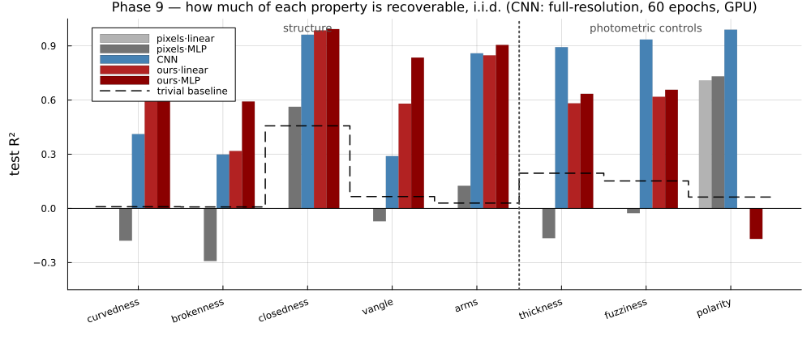
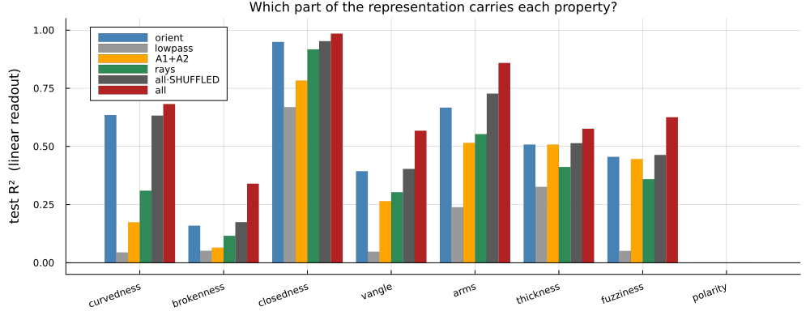
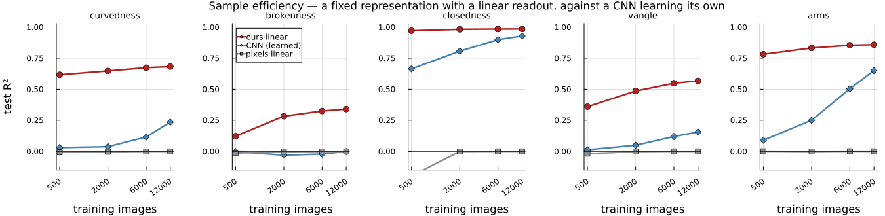

# Phase 9 — what the front end makes *explicit*

`SimpleStrokeTests` asks a different question from every phase before it. Phases 5–8 asked
whether a classifier could separate some categories; the answer was almost always yes, which
is why Phase 8 produced no information at all. Here the question is **how much of each
geometric property a *linear* readout can recover from a representation** — because a
property that needs a hidden layer to extract is present in the representation but has not
been made available by it, and making it available is the entire job of a front end.

The dataset is a single stroke on a uniform grey field, described by a vector of eight
graded properties rather than a class label. See `Contours.module.jl` for its construction
and the couplings that could not be removed; `RESULTSexpanded.md` explains everything here
from scratch, including how the splits guarantee the comparisons are fair.

---

## Summary

1. **A linear readout on 279 of our features beats a two-hidden-layer MLP on 12,544 raw
   pixels on every structural property, and beats an end-to-end CNN on all five.**
   `vangle` 0.567 vs the CNN's 0.155, `brokenness` 0.340 vs −0.002.
2. **Under nuisance shift the gap widens.** Trained on light strokes and tested on dark,
   `ours·linear` is unchanged to three decimals while both pixel arms fall far below
   predicting the mean — the MLP to −6.04.
3. **The conjunction layer finally pays, and survives its control.** Adding `A1`, `A2` and
   the ray harmonics to `orient` is worth **+0.166** on `brokenness`, **+0.164** on
   `vangle` and **+0.132** on `arms` over a shuffle control that matches column count and
   marginals exactly. On EMNIST the same layer was worth +0.01.
4. **Three hundred images is enough.** At k = 500, `ours·linear` is already at ~90 % of its
   k = 12,000 score on three of five structural rows. Raw pixels never leave zero at any k.
5. **`closedness` is confounded and should not be read as a closure result** — see below.
   Treat the other seven rows as the findings.
6. **The front end was not polarity invariant, and now is.** A bug this dataset exposed
   immediately; it could not show on EMNIST. See "The bug this found" below.

---

## The target vector

Eight properties per image, nothing masked. Rows 1–5 are geometry; rows 6–8 are controls on
the front end itself.

| # | property | range | |
|--:|:--|:--|:--|
| 1 | `curvedness` | 0–1 | mean \|κ\| of the base curve, squashed; 0 = straight |
| 2 | `brokenness` | 0–1 | gap width **in units of stroke width**; 0 = continuous |
| 3 | `closedness` | 0 / 1 | is it a closed loop |
| 4 | `vangle` | 32–180° | angle at the vertex; 180 = passes straight through |
| 5 | `arms` | 2 / 3 / 4 | arms meeting at a point; 2 = no junction |
| 6 | `thickness` | 3–12 px | stroke width |
| 7 | `fuzziness` | 0.8–20 px | edge ramp width |
| 8 | `polarity` | ±1 | light or dark stroke |

---

## The five arms

| | representation | readout | parameters |
|--:|:--|:--|--:|
| 1 | raw pixels, **fixed** | linear (ridge) | 12,544 |
| 2 | raw pixels, **fixed** | MLP, 2×256 hidden | 3.3 M |
| 3 | CNN, **learned end-to-end** | trained on these targets | 0.9 M |
| 4 | **our features, fixed** | **linear (ridge)** | **279** |
| 5 | our features, fixed | MLP, 2×256 hidden | 0.2 M |

Row 4 minus row 1 is what the front end made explicit that was not already. Row 4 against
row 3 is the harder comparison, and **every asymmetry in it runs against us**: the CNN
builds its filters *for these eight targets* while ours were fixed before the dataset
existed, and the pixel probe has 45× more free parameters than our feature probe.

---

## i.i.d. — 12,000 training images, 3,000 test

| arm | curvedness | brokenness | closedness | vangle | arms | thickness | fuzziness | polarity |
|:--|--:|--:|--:|--:|--:|--:|--:|--:|
| *trivial baseline* | 0.009 | 0.008 | 0.457 | 0.066 | 0.029 | 0.195 | 0.152 | 0.063 |
| pixels·linear | −0.000 | −0.001 | −0.000 | −0.000 | 0.000 | −0.002 | −0.000 | **0.709** |
| pixels·MLP | −0.183 | −0.404 | 0.721 | −0.137 | 0.108 | 0.007 | −0.222 | **0.787** |
| CNN | 0.235 | −0.002 | 0.929 | 0.155 | 0.650 | **0.718** | **0.852** | **0.949** |
| **ours·linear** | **0.682** | **0.340** | **0.985** | **0.567** | **0.859** | 0.576 | 0.625 | −0.000 |
| ours·MLP | **0.830** | **0.617** | **0.991** | **0.831** | **0.918** | 0.608 | 0.661 | −0.110 |

**The result splits along the structural/photometric line.** On geometry our fixed features
with a linear readout beat everything, including a CNN trained on the targets. On the three
photometric rows the CNN wins — thickness, blur and contrast sign are local statistics a
convolutional net learns directly, and two of them our representation deliberately discards.

**`pixels·linear` at exactly zero is the sanity check, not a failure.** A fixed weighted sum
of pixels is a template at a fixed location, and position and rotation are randomised, so no
template can work. That it nonetheless scores **0.709 on polarity** — the one thing linear
in pixels can see, via mean level — shows the pipeline is measuring what it should.

**`ours` at −0.000 on polarity is the correct result**, not a failure. Quadrature energy
discards the sign of contrast by construction. See the block table: *every* block is at
−0.000, so the representation throws contrast sign away entirely.

---

## Extrapolation splits

The i.i.d. table mostly measures capacity. Invariance only shows when the test set contains
nuisance values training never held. In each split the held-out nuisance's own row is
dropped — a model cannot be scored on predicting something that was constant while it
trained.

### Polarity — trained on light strokes, tested on dark

| arm | curvedness | brokenness | closedness | vangle | arms | thickness | fuzziness |
|:--|--:|--:|--:|--:|--:|--:|--:|
| *trivial* | 0.008 | 0.009 | 0.437 | 0.070 | 0.031 | 0.204 | 0.184 |
| pixels·linear | −0.130 | −0.112 | −2.352 | −0.532 | −1.773 | −2.931 | −0.889 |
| pixels·MLP | −1.806 | −1.861 | **−6.042** | −5.117 | −3.973 | −7.921 | −4.591 |
| **ours·linear** | **0.682** | **0.350** | **0.985** | **0.570** | **0.857** | 0.634 | 0.639 |
| ours·MLP | **0.850** | **0.634** | **0.996** | **0.872** | **0.925** | 0.678 | 0.709 |

`ours·linear` here is **identical to its i.i.d. row to three decimals** — perfect transfer to
a contrast polarity it never saw. Both pixel arms do not merely fail; they land far below
predicting the mean, the MLP worst at −6.04, because they have learned that dark-here means
one thing and the test set inverts it.

### Fuzziness — trained sharp (ramp ≤ 3 px), tested blurred (ramp ≥ 8 px)

| arm | curvedness | brokenness | closedness | vangle | arms | thickness |
|:--|--:|--:|--:|--:|--:|--:|
| *trivial* | 0.000 | 0.005 | 0.378 | 0.071 | 0.024 | 0.019 |
| pixels·linear | −0.001 | −0.001 | −0.004 | −0.001 | −0.004 | −0.003 |
| pixels·MLP | −0.107 | −0.353 | 0.769 | −0.146 | 0.162 | −0.229 |
| CNN | 0.200 | 0.033 | 0.911 | 0.167 | 0.580 | −2.154 |
| **ours·linear** | **0.655** | 0.107 | **0.982** | **0.525** | **0.845** | −2.547 |
| ours·MLP | **0.795** | **0.435** | **0.986** | **0.782** | **0.895** | −2.289 |

### Thickness — trained thin (≤ 6 px), tested thick (≥ 8 px)

| arm | curvedness | brokenness | closedness | vangle | arms | fuzziness |
|:--|--:|--:|--:|--:|--:|--:|
| *trivial* | −0.001 | −0.006 | −0.435 | −0.086 | −0.035 | −0.911 |
| pixels·linear | −0.002 | 0.003 | −0.001 | −0.000 | −0.004 | −0.004 |
| pixels·MLP | −0.316 | −0.471 | 0.508 | −0.461 | −0.138 | −1.747 |
| CNN | 0.180 | 0.041 | 0.920 | 0.158 | 0.582 | −0.658 |
| **ours·linear** | **0.619** | **0.333** | **0.976** | **0.490** | **0.776** | −2.052 |
| ours·MLP | **0.707** | **0.591** | **0.958** | **0.674** | **0.877** | −2.747 |

**The structural rows transfer; the coupled photometric row breaks, and should.** Blur makes
a stroke look thicker, so a thickness estimate calibrated on sharp edges is biased when
tested on blurred ones (−2.55), and vice versa (−2.05). That is a real property of the
measurement, not a failure of transfer — and it is *informative*: it says our thickness
estimate is a joint function of width and blur rather than of width alone.

`brokenness` also drops under blur (0.340 → 0.107), which is honest: a 20 px ramp fills a
small gap.

---

## `closedness` is confounded — read that row as nothing

Its trivial baseline is 0.457, by far the highest of the eight, which was the first sign.
On investigation the row is **over-determined by three local cues, none of which is closure**:

| cue | open | closed | R² for `closedness` alone |
|:--|--:|--:|--:|
| arclength | 77 px | 245 px | **0.898** |
| orientation anisotropy \|C₂\| | 0.555 | 0.148 | 0.327 |
| \|C₄\| | 0.331 | 0.034 | 0.353 |
| \|C₂\| + \|C₄\| | | | **0.490** |
| endpoint gap / stroke width | 8.5 | 0.0 | 0.295 |

**Arclength ranges are disjoint** — open 68–90 px, closed 225–283 px — so a threshold at
150 px labels every image in the dataset correctly.

None of these requires following the contour, which is the point. **Length is a sum**: total
energy is `length × width × contrast`, and since the bank measures three scales, width is
recoverable from the ratio across them and the sum can be normalised — a linear readout
reaches length without tracing anything. **Orientation isotropy is a per-cell histogram
statistic**: a closed loop turns through 2π so its tangents cover every orientation, while an
open arc capped at 2π/3 covers 120° and is strongly anisotropic. And **curvature** adds a
third, since every closed loop here has R ≤ 45 while open arcs run to R = 600.

### Why it is geometry, not a coding error

In a frame of diameter D a closed contour can be π·D long, while an open arc whose turn is
capped at 2π/3 is limited to ~1.2·D. **Closure buys length**, unavoidably. Exempting closed
loops from the arclength cap (added to stop kinked figures being clipped) widened the ratio
from ~2.6× to 3.5×, but the confound is intrinsic to putting a long contour in a small box.

### The genuine signal is present but swamped

An open arc has exactly two line terminations; a closed loop has none. That *is* local, and
detecting terminations is what `A2` end-stopping is for — **`A2` alone scores 0.783 on
`closedness`**. The right mechanism works; it is simply not needed when three shortcuts are
available.

### Not fixed, deliberately

Removing all three cues at once requires long *open* contours — spirals and serpentines,
which are long, orientation-isotropic and tightly curved while still having two free ends.
That would make `closedness` a real test of end-stopping, at the cost of stimuli that look
like scribbles rather than simple strokes. Judged not worth the change to the dataset's
character. **The row stays in the tables and should be read as "long and isotropic versus
short and anisotropic", not as closure detection.**

---

## Block attribution — and the control that decides it

| block | curvedness | brokenness | closedness | vangle | arms | thickness | fuzziness |
|:--|--:|--:|--:|--:|--:|--:|--:|
| `orient` (135 cols) | 0.635 | 0.159 | 0.949 | 0.394 | 0.667 | 0.508 | 0.455 |
| `lowpass` (9) | 0.044 | 0.051 | 0.669 | 0.047 | 0.238 | 0.326 | 0.050 |
| `A1+A2` (54) | 0.174 | 0.065 | 0.783 | 0.265 | 0.515 | 0.508 | 0.446 |
| `rays` (81) | 0.310 | 0.116 | 0.917 | 0.303 | 0.553 | 0.412 | 0.359 |
| **control: `orient`+`lowpass` intact, `A`/`rays` shuffled** (279) | 0.632 | 0.174 | 0.953 | 0.403 | 0.727 | 0.514 | 0.463 |
| **`all`** (279) | **0.682** | **0.340** | **0.985** | **0.567** | **0.859** | **0.576** | **0.625** |
| **real gain** | +0.050 | **+0.166** | +0.032 | **+0.164** | **+0.132** | +0.062 | **+0.162** |

**`all` has 279 columns against `orient`'s 135, so `all` − `orient` is not the claim.** The
control permutes the `A1`/`A2`/ray columns *across samples* — identical column count,
identical marginals, correspondence with the image destroyed — while **leaving `orient` and
`lowpass` untouched**. It is therefore "the conventional statistics plus 135 columns of
noise", and it *should* score close to `orient`: a control that collapsed to zero would be
testing nothing. Whatever it scores **above** `orient` is what capacity alone buys, and the
gap from it **up to** `all` is the conjunction layer's real contribution.

**It buys between 0.003 and 0.06.** The shuffled row sits on top of `orient` — so the gain
from the conjunction and ray blocks is information, not parameters, and the honest number is
`all` − `all·SHUFFLED`.

**This is the first positive result for the conjunction layer in the project.** Four
converging lines on EMNIST put it at +0.01, and the Phase 8 benchmark could not construct a
task where it mattered. Here it is worth **+0.166 on `brokenness`, +0.164 on `vangle`,
+0.132 on `arms`**.

**And it lands where the theory predicted.** `vangle` and `arms` are i2D by construction — a
corner angle and a ray count are not functions of an orientation histogram — and they carry
the largest gains. `closedness`, which is global and needs long-range integration rather
than local conjunction, gains almost nothing (+0.032). The operators help exactly where they
were argued to help.

---

## Sample efficiency

`ours·linear`, test R² by training-set size. Subsets are nested, so the curve moves smoothly
rather than jittering from resampling.

| k | curvedness | brokenness | closedness | vangle | arms | thickness | fuzziness |
|--:|--:|--:|--:|--:|--:|--:|--:|
| 500 | 0.617 | 0.122 | 0.971 | 0.360 | 0.782 | 0.443 | 0.470 |
| 2,000 | 0.648 | 0.283 | 0.982 | 0.486 | 0.833 | 0.516 | 0.565 |
| 6,000 | 0.674 | 0.325 | 0.985 | 0.548 | 0.855 | 0.568 | 0.615 |
| 12,000 | 0.682 | 0.340 | 0.985 | 0.567 | 0.859 | 0.576 | 0.625 |
| **% of ceiling at k=500** | **90 %** | 36 % | **99 %** | 64 % | **91 %** | 77 % | 75 % |

And the CNN over the same nested subsets — the comparison that makes the point:

| k | curvedness | brokenness | closedness | vangle | arms |
|--:|--:|--:|--:|--:|--:|
| 500 | 0.030 | −0.003 | 0.664 | 0.012 | 0.089 |
| 2,000 | 0.038 | −0.031 | 0.807 | 0.049 | 0.250 |
| 6,000 | 0.116 | −0.022 | 0.899 | 0.119 | 0.504 |
| 12,000 | 0.235 | −0.002 | 0.929 | 0.155 | 0.650 |
| **% of *its own* ceiling at k=500** | 13 % | — | 71 % | 8 % | **14 %** |

**A fixed representation starts where it will finish; a learned one has to buy its
representation with data.** On `arms`, ours moves 0.782 → 0.859 across a 24× increase in
data while the CNN moves 0.089 → 0.650. At 500 images the gap is **8.8×**; by 12,000 it is
1.3× and still closing.

**That is the honest shape of the result.** Two of the CNN's curves are climbing steeply at
the right-hand edge — `arms` gained +0.146 over the last doubling — so with substantially
more data, more epochs, or both, it would likely close the gap on `curvedness` and `arms`.
What it does *not* do is learn `brokenness` at all: flat within noise of zero at every size,
where ours reaches 0.340. A 3 px gap in a 112 px image appears to be below what this
architecture extracts at any sample size tested.

`pixels·linear` is at 0.000 ± 0.02 for every property at every k, except polarity where it
sits at 0.689–0.709 throughout. **More data does not help a representation that does not
contain the property**, which is the cleanest statement of what a front end is for.

Two rows are still climbing at k = 12,000 — `brokenness` (36 % of ceiling at k=500) and
`vangle` (64 %). Those are the two finest-grained properties, and the two most likely to be
limited by the 3×3 pooling grid rather than by data.

---

## The bug this found

On its first real run the block table showed `orient` predicting **polarity at R² 0.65**,
when quadrature energy should predict nothing at all. Rendering the same shape at both
polarities showed features differing by **29 %** between a stroke and its exact
contrast-reverse. **The front end was not polarity invariant.**

The cause is padding. The bank zero-pads the image into a larger field. On EMNIST the
background *is* zero, so the padding was seamless and this could never appear. Here the
background is ≈ 0.5, so zero-padding puts a full-contrast step around the whole border, and
the response becomes `R_border + pol·R_stroke`, whose squared magnitude carries a cross term
`2·pol·Re(R_border · conj(R_stroke))` that **flips sign with polarity**.

Subtracting the median before filtering makes the padded zeros continuous with the
background. Invariance is now exact to float precision — **2.4 × 10⁻⁷** relative, from 29 %.

It also cost real accuracy on every other row, because that spurious border edge was noise
in every feature. On 1,000 training images: `closedness` 0.63 → 0.93, `vangle` 0.04 → 0.38,
`arms` 0.23 → 0.57.

**This matters beyond this experiment.** Polarity invariance is a stated requirement of the
project and has been claimed throughout. It was silently false for any image without a zero
background. Only EMNIST's black background hid it — which is precisely the argument for
testing on something that is not characters.

### A prediction it corrected

On record before the run: *"`orient` ≈ 0, `lowpass` ≈ 1"* — the oriented channels blind to
polarity, the lowpass block reading it perfectly. **Wrong on the second half.** `lowpass` is
the magnitude of a DC-centred channel, and magnitudes discard sign, so it is equally blind.
The representation throws contrast sign away *entirely*, which is stronger and cleaner than
claimed — but it does mean nothing downstream can ever recover contrast sign from these
features.

---

## Corrections to earlier write-ups

`RationalGaborFeatures/RESULTS.md` states:

> no task has been constructed on which the conjunction layer beats the orientation
> statistics — not EMNIST, not the binary `F`/`f` probe, and not a synthetic benchmark built
> specifically to require co-location.

**That sentence is now false.** Phase 9 is such a task. The EMNIST conclusion stands
unchanged — the layer really does add ≈ 0 there, for the reason Phase 7 gave, that A is 93 %
linearly recoverable from `orient` on handwriting. What Phase 9 shows is that this was a
statement about **EMNIST**, not about the operators: on stimuli where corner angle and
junction order actually vary independently of everything else, the conjunction blocks carry
information the orientation statistics do not.

---

## Caveats

**The CNN is undertrained.** 12 epochs on CPU, validation R² still rising at the last epoch
(0.549 → 0.556). More training would raise it, possibly a lot. Its numbers are a floor, not
a demonstrated ceiling, and should be read that way.

**The shuffle control is one permutation**, not a distribution over permutations. Worth
repeating across seeds before this is published.

**The pooling grid is 3×3** — cells ~37 px on a 112 px image, while figures are 68–96 px
long. `brokenness` at 0.340 is the row most likely limited by that: a 3 px gap is a small
perturbation inside a 37 px cell. `grid=5` is a one-parameter change and the obvious next
run.

**The representation is not translation invariant** — a fixed spatial grid against
randomised position, where a CNN is translation-equivariant for free. That handicap runs
against us throughout.

**`closedness` measures the wrong thing**, as set out above. Every number in that column,
for every arm, should be discounted.

**One seed per arm.** No error bars. Differences of 0.02 should not be read as real;
differences of 0.4 should.

---

## Open

1. **Repeat the shuffle control across seeds**, and add a matched-column control (a random
   subset of 135 `all` columns against 135 `orient` columns).
2. **`grid=5`**, to see whether `brokenness` and `vangle` are operator-limited or
   pooling-limited.
3. **Train the CNN to convergence**, on a GPU if one is available, so the comparison is
   against a real ceiling.
4. **Re-check the EMNIST numbers with the polarity fix in place.** EMNIST's background is
   zero so the border artefact should be absent, but "should be" is not "was measured".
5. **A closed curve carrying a corner or a branch**, which would remove the
   `closedness`–`vangle`–`arms` coupling of ~0.22 that this dataset could not avoid.
