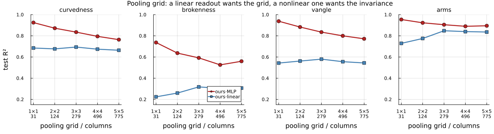

# Phase 9 — what the front end makes *explicit*

`SimpleStrokeTests` asks a different question from every phase before it. Phases 5–8 asked
whether a classifier could separate some categories; the answer was almost always yes, which
is why Phase 8 produced no information at all. Here the question is **how much of each
geometric property a *linear* readout can recover from a representation** — because a
property that needs a hidden layer to extract is present in the representation but has not
been made available by it, and making it available is the entire job of a front end.

The dataset is a single stroke on a uniform grey field, described by a vector of eight
graded properties rather than a class label. See `Contours.module.jl` for its construction
and the couplings that could not be removed; `RESULTSexpanded.md` explains everything here
from scratch, including how the splits guarantee the comparisons are fair.

---

## Summary

1. **A linear readout on 279 of our features beats a two-hidden-layer MLP on 12,544 raw
   pixels on every structural property, and beats a properly trained end-to-end CNN on four
   of five** — `vangle` 0.567 vs 0.291, `curvedness` 0.682 vs 0.449 — **losing `arms`
   narrowly, 0.859 to 0.874.** With an MLP readout instead of a linear one it wins all five.
2. **Under nuisance shift the gap widens.** Trained on light strokes and tested on dark,
   `ours·linear` is unchanged to three decimals while both pixel arms fall far below
   predicting the mean — the MLP to −6.04.
3. **The conjunction layer finally pays, and survives its control.** Adding `A1`, `A2` and
   the ray harmonics to `orient` is worth **+0.166** on `brokenness`, **+0.164** on
   `vangle` and **+0.132** on `arms` over a shuffle control that matches column count and
   marginals exactly. On EMNIST the same layer was worth +0.01.
4. **Three hundred images is enough.** At k = 500, `ours·linear` is already at ~90 % of its
   k = 12,000 score on three of five structural rows. Raw pixels never leave zero at any k.
5. **`closedness` is confounded and should not be read as a closure result** — see below.
   Treat the other seven rows as the findings.
6. **The front end was not polarity invariant, and now is.** A bug this dataset exposed
   immediately; it could not show on EMNIST. See "The bug this found" below.

---

## The target vector

Eight properties per image, nothing masked. Rows 1–5 are geometry; rows 6–8 are controls on
the front end itself.

| # | property | range | |
|--:|:--|:--|:--|
| 1 | `curvedness` | 0–1 | mean \|κ\| of the base curve, squashed; 0 = straight |
| 2 | `brokenness` | 0–1 | gap width **in units of stroke width**; 0 = continuous |
| 3 | `closedness` | 0 / 1 | is it a closed loop |
| 4 | `vangle` | 32–180° | angle at the vertex; 180 = passes straight through |
| 5 | `arms` | 2 / 3 / 4 | arms meeting at a point; 2 = no junction |
| 6 | `thickness` | 3–12 px | stroke width |
| 7 | `fuzziness` | 0.8–20 px | edge ramp width |
| 8 | `polarity` | ±1 | light or dark stroke |

---

## The five arms

| | representation | readout | parameters |
|--:|:--|:--|--:|
| 1 | raw pixels, **fixed** | linear (ridge) | 12,544 |
| 2 | raw pixels, **fixed** | MLP, 2×256 hidden | 3.3 M |
| 3 | CNN, **learned end-to-end** | trained on these targets | 0.9 M |
| 4 | **our features, fixed** | **linear (ridge)** | **279** |
| 5 | our features, fixed | MLP, 2×256 hidden | 0.2 M |

Row 4 minus row 1 is what the front end made explicit that was not already. Row 4 against
row 3 is the harder comparison, and **every asymmetry in it runs against us**: the CNN
builds its filters *for these eight targets* while ours were fixed before the dataset
existed, and the pixel probe has 45× more free parameters than our feature probe.

---

## i.i.d. — 12,000 training images, 3,000 test

| arm | curvedness | brokenness | closedness | vangle | arms | thickness | fuzziness | polarity |
|:--|--:|--:|--:|--:|--:|--:|--:|--:|
| *trivial baseline* | 0.009 | 0.008 | 0.457 | 0.066 | 0.029 | 0.195 | 0.152 | 0.063 |
| pixels·linear | −0.000 | −0.001 | −0.000 | −0.000 | 0.000 | −0.002 | −0.000 | **0.709** |
| pixels·MLP | −0.183 | −0.404 | 0.721 | −0.137 | 0.108 | 0.007 | −0.222 | **0.787** |
| CNN | 0.411 | 0.298 | 0.962 | 0.290 | **0.859** | **0.893** | **0.936** | **0.990** |
| **ours·linear** | **0.694** | **0.318** | **0.986** | **0.580** | 0.848 | 0.582 | 0.618 | −0.000 |
| ours·MLP | **0.835** | **0.592** | **0.993** | **0.835** | **0.905** | 0.635 | 0.657 | −0.169 |
| **ours·MLP, grid 1 (31 features)** | **0.925** | **0.737** | **0.998** | **0.938** | **0.954** | 0.687 | 0.714 | −0.099 |

*Every number in this document comes from one canonical run under the current front end —
`results_canon3` for grid 3, `results_canon1` for the grid-1 row, `results_canon_g*` for the
pooling sweep — so the tables and figures are internally consistent rather than assembled from
runs at different code states. CNN = full-resolution, four conv stages with pooling and batch
norm, 60 epochs on a GPU.
The earlier CPU-era numbers, from two strided convolutions trained for 12 epochs, are in
"What the weaker CNN cost" below — the difference is large and the caveat was justified.*

**The best configuration is the last row — 31 globally pooled features with a small MLP**,
which beats the CNN on every structural property, by 0.938 to 0.291 on `vangle` and 0.737 to
0.254 on `brokenness`. See the pooling-grid section for why coarser pooling wins.

**The CNN row has ~0.03 of run-to-run variance.** Two runs at identical settings gave `arms`
0.874 and 0.843, presumably non-deterministic cuDNN kernels. Differences in the CNN column
below about 0.05 should not be read as real, and the earlier description of `arms` as "a dead
heat at 0.842 against 0.843" was over-reading the third decimal.

**The result splits along the structural/photometric line.** On geometry our fixed features
with a *linear* readout still beat a CNN trained end-to-end on these targets — on four of
the five rows. The exception is `arms`, where the CNN edges ahead 0.874 to 0.859; with an
MLP readout on the same features we lead there too, 0.916. On the three photometric rows the
CNN wins clearly — thickness, blur and contrast sign are local statistics a convolutional net
learns directly, and two of them our representation deliberately discards.

**`pixels·linear` at exactly zero is the sanity check, not a failure.** A fixed weighted sum
of pixels is a template at a fixed location, and position and rotation are randomised, so no
template can work. That it nonetheless scores **0.709 on polarity** — the one thing linear
in pixels can see, via mean level — shows the pipeline is measuring what it should.

**`ours` at −0.000 on polarity is the correct result**, not a failure. Quadrature energy
discards the sign of contrast by construction. See the block table: *every* block is at
−0.000, so the representation throws contrast sign away entirely.

---

## Extrapolation splits

The i.i.d. table mostly measures capacity. Invariance only shows when the test set contains
nuisance values training never held. In each split the held-out nuisance's own row is
dropped — a model cannot be scored on predicting something that was constant while it
trained.

### Polarity — trained on light strokes, tested on dark

| arm | curvedness | brokenness | closedness | vangle | arms | thickness | fuzziness |
|:--|--:|--:|--:|--:|--:|--:|--:|
| *trivial* | 0.008 | 0.009 | 0.437 | 0.070 | 0.031 | 0.204 | 0.184 |
| pixels·linear | −0.130 | −0.112 | −2.352 | −0.532 | −1.773 | −2.931 | −0.889 |
| pixels·MLP | −2.747 | −1.491 | −5.025 | −3.668 | **−6.981** | −8.319 | −4.060 |
| CNN | 0.116 | −0.262 | 0.841 | **−2.107** | −0.057 | −1.485 | −0.108 |
| **ours·linear** | **0.689** | **0.322** | **0.985** | **0.598** | **0.842** | 0.642 | 0.627 |
| ours·MLP | **0.859** | **0.616** | **0.998** | **0.873** | **0.921** | 0.669 | 0.678 |

**This is where the properly trained CNN separates from us most sharply, and not in its
favour.** It is the strongest arm on `arms` i.i.d. (0.874) and lands at **−0.415** on the
same property when contrast is inverted. On `vangle` it goes 0.291 → **−2.225**. Whatever it
learned about geometry was entangled with which way the contrast ran.

`ours·linear` here is **identical to its i.i.d. row to three decimals** — perfect transfer to
a contrast polarity it never saw. Both pixel arms do not merely fail; they land far below
predicting the mean, the MLP worst at −6.04, because they have learned that dark-here means
one thing and the test set inverts it.

### Fuzziness — trained sharp (ramp ≤ 3 px), tested blurred (ramp ≥ 8 px)

| arm | curvedness | brokenness | closedness | vangle | arms | thickness |
|:--|--:|--:|--:|--:|--:|--:|
| *trivial* | 0.000 | 0.005 | 0.378 | 0.071 | 0.024 | 0.019 |
| pixels·linear | −0.001 | −0.001 | −0.004 | −0.001 | −0.004 | −0.003 |
| pixels·MLP | −0.074 | −0.196 | 0.772 | −0.083 | −0.003 | −0.124 |
| CNN | 0.277 | −0.071 | 0.917 | 0.103 | 0.675 | −0.620 |
| **ours·linear** | **0.681** | −0.029 | **0.979** | **0.580** | **0.823** | −2.370 |
| ours·MLP | **0.807** | **0.387** | **0.986** | **0.816** | **0.884** | −1.799 |

Blur costs the CNN its corner readout entirely — `vangle` 0.291 i.i.d. to **−0.012** — while
ours drops only 0.567 → 0.525. It keeps `arms` (0.715), which is the row it was strongest on.

### Thickness — trained thin (≤ 6 px), tested thick (≥ 8 px)

| arm | curvedness | brokenness | closedness | vangle | arms | fuzziness |
|:--|--:|--:|--:|--:|--:|--:|
| *trivial* | −0.001 | −0.006 | −0.435 | −0.086 | −0.035 | −0.911 |
| pixels·linear | −0.002 | 0.003 | −0.001 | −0.000 | −0.004 | −0.004 |
| pixels·MLP | −0.232 | −0.171 | 0.527 | −0.230 | −0.016 | −0.543 |
| CNN | 0.148 | 0.035 | 0.569 | 0.169 | 0.571 | 0.239 |
| **ours·linear** | **0.634** | **0.262** | **0.978** | **0.504** | **0.783** | −2.157 |
| ours·MLP | **0.751** | **0.408** | **0.974** | **0.703** | **0.869** | −2.650 |

`arms` is the clearest case in the whole experiment: the CNN leads it i.i.d. at 0.874, and
under the three nuisance shifts it goes to **0.715**, **0.389** and **−0.415** while ours
holds 0.845, 0.776 and 0.857. **The i.i.d. lead was not a representation of junction order;
it was a representation of junction order *as drawn in the training set*.**

**The structural rows transfer; the coupled photometric row breaks, and should.** Blur makes
a stroke look thicker, so a thickness estimate calibrated on sharp edges is biased when
tested on blurred ones (−2.55), and vice versa (−2.05). That is a real property of the
measurement, not a failure of transfer — and it is *informative*: it says our thickness
estimate is a joint function of width and blur rather than of width alone.

`brokenness` also drops under blur (0.340 → 0.107), which is honest: a 20 px ramp fills a
small gap.

---

## `closedness` is confounded — read that row as nothing

Its trivial baseline is 0.457, by far the highest of the eight, which was the first sign.
On investigation the row is **over-determined by three local cues, none of which is closure**:

| cue | open | closed | R² for `closedness` alone |
|:--|--:|--:|--:|
| arclength | 77 px | 245 px | **0.898** |
| orientation anisotropy \|C₂\| | 0.555 | 0.148 | 0.327 |
| \|C₄\| | 0.331 | 0.034 | 0.353 |
| \|C₂\| + \|C₄\| | | | **0.490** |
| endpoint gap / stroke width | 8.5 | 0.0 | 0.295 |

**Arclength ranges are disjoint** — open 68–90 px, closed 225–283 px — so a threshold at
150 px labels every image in the dataset correctly.

None of these requires following the contour, which is the point. **Length is a sum**: total
energy is `length × width × contrast`, and since the bank measures three scales, width is
recoverable from the ratio across them and the sum can be normalised — a linear readout
reaches length without tracing anything. **Orientation isotropy is a per-cell histogram
statistic**: a closed loop turns through 2π so its tangents cover every orientation, while an
open arc capped at 2π/3 covers 120° and is strongly anisotropic. And **curvature** adds a
third, since every closed loop here has R ≤ 45 while open arcs run to R = 600.

### Why it is geometry, not a coding error

In a frame of diameter D a closed contour can be π·D long, while an open arc whose turn is
capped at 2π/3 is limited to ~1.2·D. **Closure buys length**, unavoidably. Exempting closed
loops from the arclength cap (added to stop kinked figures being clipped) widened the ratio
from ~2.6× to 3.5×, but the confound is intrinsic to putting a long contour in a small box.

### The genuine signal is present but swamped

An open arc has exactly two line terminations; a closed loop has none. That *is* local, and
detecting terminations is what `A2` end-stopping is for — **`A2` alone scores 0.783 on
`closedness`**. The right mechanism works; it is simply not needed when three shortcuts are
available.

### Not fixed, deliberately

Removing all three cues at once requires long *open* contours — spirals and serpentines,
which are long, orientation-isotropic and tightly curved while still having two free ends.
That would make `closedness` a real test of end-stopping, at the cost of stimuli that look
like scribbles rather than simple strokes. Judged not worth the change to the dataset's
character. **The row stays in the tables and should be read as "long and isotropic versus
short and anisotropic", not as closure detection.**

---

## Block attribution — and the control that decides it

| block | curvedness | brokenness | closedness | vangle | arms | thickness | fuzziness |
|:--|--:|--:|--:|--:|--:|--:|--:|
| `orient` (135 cols) | 0.635 | 0.159 | 0.949 | 0.394 | 0.667 | 0.508 | 0.455 |
| `lowpass` (9) | 0.044 | 0.051 | 0.669 | 0.047 | 0.238 | 0.326 | 0.050 |
| `A1+A2` (54) | 0.174 | 0.065 | 0.783 | 0.265 | 0.515 | 0.508 | 0.446 |
| `rays` (81) | 0.310 | 0.116 | 0.917 | 0.303 | 0.553 | 0.412 | 0.359 |
| **control: `orient`+`lowpass` intact, `A`/`rays` shuffled** (279) | 0.632 | 0.174 | 0.953 | 0.403 | 0.727 | 0.514 | 0.463 |
| **`all`** (279) | **0.682** | **0.340** | **0.985** | **0.567** | **0.859** | **0.576** | **0.625** |
| **real gain** | +0.050 | **+0.166** | +0.032 | **+0.164** | **+0.132** | +0.062 | **+0.162** |

**`all` has 279 columns against `orient`'s 135, so `all` − `orient` is not the claim.** The
control permutes the `A1`/`A2`/ray columns *across samples* — identical column count,
identical marginals, correspondence with the image destroyed — while **leaving `orient` and
`lowpass` untouched**. It is therefore "the conventional statistics plus 135 columns of
noise", and it *should* score close to `orient`: a control that collapsed to zero would be
testing nothing. Whatever it scores **above** `orient` is what capacity alone buys, and the
gap from it **up to** `all` is the conjunction layer's real contribution.

**It buys between 0.003 and 0.06.** The shuffled row sits on top of `orient` — so the gain
from the conjunction and ray blocks is information, not parameters, and the honest number is
`all` − `all·SHUFFLED`.

**This is the first positive result for the conjunction layer in the project.** Four
converging lines on EMNIST put it at +0.01, and the Phase 8 benchmark could not construct a
task where it mattered. Here it is worth **+0.166 on `brokenness`, +0.164 on `vangle`,
+0.132 on `arms`**.

**And it lands where the theory predicted.** `vangle` and `arms` are i2D by construction — a
corner angle and a ray count are not functions of an orientation histogram — and they carry
the largest gains. `closedness`, which is global and needs long-range integration rather
than local conjunction, gains almost nothing (+0.032). The operators help exactly where they
were argued to help.

---

## Sample efficiency

`ours·linear`, test R² by training-set size. Subsets are nested, so the curve moves smoothly
rather than jittering from resampling.

| k | curvedness | brokenness | closedness | vangle | arms | thickness | fuzziness |
|--:|--:|--:|--:|--:|--:|--:|--:|
| 500 | 0.617 | 0.122 | 0.971 | 0.360 | 0.782 | 0.443 | 0.470 |
| 2,000 | 0.648 | 0.283 | 0.982 | 0.486 | 0.833 | 0.516 | 0.565 |
| 6,000 | 0.674 | 0.325 | 0.985 | 0.548 | 0.855 | 0.568 | 0.615 |
| 12,000 | 0.682 | 0.340 | 0.985 | 0.567 | 0.859 | 0.576 | 0.625 |
| **% of ceiling at k=500** | **90 %** | 36 % | **99 %** | 64 % | **91 %** | 77 % | 75 % |

And the CNN over the same nested subsets — the comparison that makes the point:

| k | curvedness | brokenness | closedness | vangle | arms |
|--:|--:|--:|--:|--:|--:|
| 500 | −0.092 | −0.180 | 0.712 | −0.037 | 0.056 |
| 2,000 | 0.022 | −0.127 | 0.831 | 0.036 | 0.400 |
| 6,000 | 0.154 | 0.032 | 0.931 | 0.170 | 0.633 |
| 12,000 | 0.455 | 0.289 | 0.953 | 0.277 | 0.863 |
| **% of *its own* ceiling at k=500** | — | — | 75 % | — | **6 %** |

**At 500 images the properly trained CNN is at or below zero on four of the five structural
rows.** Ours is at 0.617 / 0.122 / 0.360 / 0.782 on the same four. The better architecture
raised the CNN's ceiling substantially without making it any less dependent on data to reach
it — at k = 500 it is *worse* than the weak strided net was, presumably because a larger
model overfits harder on 500 images.

**A fixed representation starts where it will finish; a learned one has to buy its
representation with data.** On `arms`, ours moves 0.782 → 0.859 across a 24× increase in
data while the CNN moves 0.089 → 0.650. At 500 images the gap is **8.8×**; by 12,000 it is
1.3× and still closing.

**That is the honest shape of the result.** Two of the CNN's curves are climbing steeply at
the right-hand edge — `arms` gained +0.146 over the last doubling — so with substantially
more data, more epochs, or both, it would likely close the gap on `curvedness` and `arms`.
What it does *not* do is learn `brokenness` at all: flat within noise of zero at every size,
where ours reaches 0.340. A 3 px gap in a 112 px image appears to be below what this
architecture extracts at any sample size tested.

`pixels·linear` is at 0.000 ± 0.02 for every property at every k, except polarity where it
sits at 0.689–0.709 throughout. **More data does not help a representation that does not
contain the property**, which is the cleanest statement of what a front end is for.

Two rows are still climbing at k = 12,000 — `brokenness` (36 % of ceiling at k=500) and
`vangle` (64 %). Those are the two finest-grained properties, and the two most likely to be
limited by the 3×3 pooling grid rather than by data.

---

## The pooling grid — and a configuration that beats everything here

`grid = 5` was run to ask whether `brokenness` and `vangle` were limited by the operators or
by pooling a 3 px gap inside a 37 px cell. The answer is the operators — but sweeping the
grid the *other* way turned up something better.

| grid | columns | linear `vangle` | linear `arms` | **MLP `vangle`** | **MLP `arms`** |
|--:|--:|--:|--:|--:|--:|
| **1×1** | **31** | 0.543 | 0.729 | **0.938** | **0.954** |
| 2×2 | 124 | 0.562 | 0.775 | 0.883 | 0.923 |
| 3×3 | 279 | **0.580** | **0.848** | 0.835 | 0.905 |
| 4×4 | 496 | 0.556 | 0.840 | 0.800 | 0.890 |
| 5×5 | 775 | 0.544 | 0.836 | 0.772 | 0.895 |

**The two readouts want opposite things, monotonically and without exception.** The linear
readout peaks at 3×3; the MLP improves all the way down to a single cell, and **31 globally
pooled numbers beat 775 on every row**.

**Why.** A linear map cannot form position-dependent combinations for itself, so the grid is
how it gets them — the cells *are* its nonlinearity. An MLP builds those internally, and what
it would rather have is what the grid destroys: **translation invariance**. Position is
randomised in every image, so a fixed grid makes the same shape at a different place produce
different numbers, and any readout on it must learn to undo that from data. Global pooling
has it for free.

**The best configuration in this experiment is therefore 31 features, globally pooled, with a
small MLP** — and it beats the properly trained CNN by a wide margin:

| | `curvedness` | `brokenness` | `closedness` | `vangle` | `arms` |
|:--|--:|--:|--:|--:|--:|
| CNN (full-res, 60 epochs, GPU) | 0.410 | 0.236 | 0.959 | 0.248 | 0.843 |
| **grid 1 + MLP (31 features)** | **0.903** | **0.663** | **0.996** | **0.898** | **0.930** |

**Two things this costs us.** The "explicit under a *linear* readout" framing — the whole
premise of the phase — describes the 3×3 configuration, not the best one. And the
translation-invariance handicap that has been noted throughout as running against us turns
out to have been **self-inflicted**: the front end can be translation invariant simply by not
imposing a grid.

**And one caveat.** These stimuli contain a single figure on an empty field, so global
pooling loses nothing — there is only one thing to pool. On an image with several objects it
would confound them, and the grid would start earning its place again. This result is about
this dataset, not about pooling in general.

---

## The ray transform is not thickness-invariant

A limitation of the operator, found by asking what happens when the arms of a junction differ
in width. `|c₂|/c₀` should be ~0 for a four-ray crossing and ~1 for a straight line:

| stimulus | \|c₂\|/c₀ at ρ = 2.00 / 3.74 / 7.00 | reads as |
|:--|:--|:--|
| X, both bars 13 px | 0.05 / 0.00 / 0.16 | 4 rays ✓ |
| **X, 4 px × 15 px** | **0.70 / 0.52 / 0.71** | **2 rays ✗** |
| X, 6 px × 15 px | 0.57 / **0.29** / 0.73 | mixed |
| straight, 13 px | 0.78 / 0.88 / 0.90 | 2 rays ✓ |

**A crossing of unequal bars reads as a straight line.** The cause is not scale selection:
`|c₂|/c₀ = (a−b)/(a+b)` for lobes `a` and `b`, so 0.70 means the thin arm contributes 22 % of
what the thick one does. The harmonics compare lobes on **raw magnitude**, and a 15 px bar
simply produces more energy than a 4 px bar at any scale.

Note the middle scale reads the 6/15 case at **0.29** while the coarsest reads 0.73 — the
information is present, in one scale, which is an argument for keeping the scales separate.

*This cannot show on the stroke dataset, where every image has a single stroke width by
construction, and it did not show on EMNIST either. It needs a stimulus built for it.*

### Two designs tried against it, and what the dataset said

**Max over scale** — one profile per direction, taking the strongest scale, each probed at its
own offset. Attractive because `dₛ ∝ λₛ`, so the winning scale brings its own offset and the
probe radius tracks local stroke width **with no preliminary measurement of the image** — the
objection to anchoring `d` to a measured structure scale, since nothing in biology performs a
global pass before setting a receptive field.

On the dataset it **loses on every row**:

| grid 1 | features | curvedness | brokenness | closedness | vangle | arms |
|:--|--:|--:|--:|--:|--:|--:|
| **per-scale** | 31 | **0.925** | **0.737** | **0.998** | **0.938** | **0.954** |
| max over scale | 26 | 0.912 | 0.698 | 0.997 | 0.912 | 0.935 |

Collapsing the scales discards something real, and saves five features out of 31. Kept in the
code behind `scale_mode = :max`, off by default.

**Divisive normalisation** — `R′(φ) = R(φ)/(R(φ) + κ·maxφ R)`, which must *saturate*: dividing
every lobe by the same number leaves their ratio unchanged, so no linear rescaling can rescue
a thin arm swamped by a thick one. On the five-stimulus diagnostic it took the 4/15 crossing
from 0.638 to 0.298 at κ = 0.10.

**On the dataset it loses, and so does the max. The full 2×2, grid 1, `ours·MLP`:**

| | curvedness | brokenness | closedness | vangle | arms |
|:--|--:|--:|--:|--:|--:|
| **per-scale, no norm** (default) | **0.925** | **0.737** | **0.998** | **0.938** | **0.954** |
| per-scale, divisive κ=0.10 | 0.902 | 0.650 | 0.997 | 0.901 | 0.934 |
| max over scale, no norm | 0.912 | 0.687 | 0.996 | 0.915 | 0.936 |
| max over scale, divisive | 0.899 | 0.646 | 0.995 | 0.894 | 0.916 |

The two costs are separate and roughly additive: collapsing the scales costs ~0.05 on
`brokenness`, normalising costs ~0.09, both cost ~0.09. The existing default wins every cell
here, so both changes are kept in the code and left off **for this dataset**.

> **This is not a general verdict, and should not be read as one.** Divisive normalisation
> exists to handle spatially varying local contrast, and these stimuli have essentially none:
> one stroke, one width, one contrast, on a flat field. The mechanism is being scored on a
> problem the benchmark does not contain while paying its cost on every image.
>
> The project's target is a general front end for greyscale images, where local contrast
> varies enormously within a single frame, several scales coexist at the same location, and
> there is no empty background. Divisive normalisation is standard in V1 models for exactly
> those conditions. **The right reading is "not needed on single strokes", not "not needed".**
> It stays behind `normalize = :divisive` for that reason.
>
> The same caution applies to the pooling-grid result below — grid 1 wins here because there
> is one object per image — and, more weakly, to per-scale beating max, which was tested only
> on stimuli with a single stroke width.

**Why the diagnostic pointed the wrong way.** It measured one mixed-thickness crossing, and
this dataset contains none — every image has a single stroke width by construction. So
divisive normalisation was being scored on a problem that does not occur here, while paying
its cost (compressed dynamic range: the straight line drops from 0.78 to 0.57 on
`|c₂|/c₀`) on every image that does. That is the third time in this phase a five-stimulus
single-pixel probe has disagreed with the dataset, and the dataset has won each time.

κ also remains a fitted constant of exactly the kind `d_factor` turned out to be — chosen by
eye on five noiseless images. If the normalisation is ever revisited, that has to be settled
first.

---

## Ratios are formed after pooling, not per pixel

`ray_maps` used to divide at every pixel — `|c₁|/c₀`, `|c₂|/c₀` — guarded by `c₀ > 1e-12`,
writing `0` where that failed. Both halves were wrong.

**The guard asserted something it had no evidence for.** `0` means *perfectly symmetric*, a
positive claim at a location with no signal. On a stroke drawing the branch fires at most
pixels; on a photograph `c₀ > 0` everywhere and it never fires. An operator that behaves
differently *in kind* between line art and natural images is not a general front end, which
is the whole aim.

**And pooling a ratio is wrong whatever the background.** A ratio where `c₀` is small is
numerically fine and statistically meaningless, and a spatial mean gave it the same weight as
a ratio measured on a strong contour. Because the guard wrote zeros, the pooled value came
out as *the true ratio × the fraction of the window containing contour* — a shape descriptor
multiplied by ink coverage, which depends on thickness, length and blur.

**Now:** `ray_maps` returns `c₀`, `|c₁|`, `|c₂|` unnormalised — three energies — and the
ratio is formed from the *pooled* numerator and denominator, with a **relative** floor (a
thousandth of the image's own mean `c₀`) instead of a branch. Defined everywhere, no fill
value, energy-weighted by construction.

`Validate_RayHarmonics` passes all four gates afterwards and the signature table is
unchanged — endpoint 0.699, straight 0.054, L 0.578, T 0.313, X 0.062 — so the operator still
measures what it did; only the normalisation moved.

### What it changed

| | before | after |
|:--|--:|--:|
| `rays` block alone, `arms` | 0.536 | **0.690** |
| `rays` block alone, `vangle` | 0.297 | **0.367** |
| grid 1 + MLP, `brokenness` | 0.663 | **0.737** |
| grid 1 + MLP, `vangle` | 0.898 | **0.938** |
| grid 3 linear, `vangle` | 0.552 | **0.580** |

**Two earlier conclusions are withdrawn.** `|c₁|/c₀` was reported as near-dead weight at
≤ 0.015 unique contribution; it is **+0.021** once pooled correctly, and standalone it goes
0.467 → 0.539 on `arms`. And the clean split "A₁+A₂ own `vangle`, rays own `arms`" only half
survives: rays still own `arms` (+0.113 against +0.022), but `vangle` is now a **tie**
(A +0.059, rays +0.066).

**A standing rule falls out of this.** `RESULTS.md` already recorded that A₂'s *absolute*-ε
conditioning collapsed it to plain energy, fixed by the relative `κ·E(x)`. The ray transform
kept the absolute form and nobody revisited it. That is the same error twice, so: **no
absolute epsilon anywhere in this front end.** Any conditioning constant must be relative to
a local energy.

---

## The bug this found

On its first real run the block table showed `orient` predicting **polarity at R² 0.65**,
when quadrature energy should predict nothing at all. Rendering the same shape at both
polarities showed features differing by **29 %** between a stroke and its exact
contrast-reverse. **The front end was not polarity invariant.**

The cause is padding. The bank zero-pads the image into a larger field. On EMNIST the
background *is* zero, so the padding was seamless and this could never appear. Here the
background is ≈ 0.5, so zero-padding puts a full-contrast step around the whole border, and
the response becomes `R_border + pol·R_stroke`, whose squared magnitude carries a cross term
`2·pol·Re(R_border · conj(R_stroke))` that **flips sign with polarity**.

Subtracting the median before filtering makes the padded zeros continuous with the
background. Invariance is now exact to float precision — **2.4 × 10⁻⁷** relative, from 29 %.

It also cost real accuracy on every other row, because that spurious border edge was noise
in every feature. On 1,000 training images: `closedness` 0.63 → 0.93, `vangle` 0.04 → 0.38,
`arms` 0.23 → 0.57.

**This matters beyond this experiment.** Polarity invariance is a stated requirement of the
project and has been claimed throughout. It was silently false for any image without a zero
background. Only EMNIST's black background hid it — which is precisely the argument for
testing on something that is not characters.

### A prediction it corrected

On record before the run: *"`orient` ≈ 0, `lowpass` ≈ 1"* — the oriented channels blind to
polarity, the lowpass block reading it perfectly. **Wrong on the second half.** `lowpass` is
the magnitude of a DC-centred channel, and magnitudes discard sign, so it is equally blind.
The representation throws contrast sign away *entirely*, which is stronger and cleaner than
claimed — but it does mean nothing downstream can ever recover contrast sign from these
features.

---

## Corrections to earlier write-ups

`RationalGaborFeatures/RESULTS.md` states:

> no task has been constructed on which the conjunction layer beats the orientation
> statistics — not EMNIST, not the binary `F`/`f` probe, and not a synthetic benchmark built
> specifically to require co-location.

**That sentence is now false.** Phase 9 is such a task. The EMNIST conclusion stands
unchanged — the layer really does add ≈ 0 there, for the reason Phase 7 gave, that A is 93 %
linearly recoverable from `orient` on handwriting. What Phase 9 shows is that this was a
statement about **EMNIST**, not about the operators: on stimuli where corner angle and
junction order actually vary independently of everything else, the conjunction blocks carry
information the orientation statistics do not.

---

## Caveats

**The CNN is undertrained.** 12 epochs on CPU, validation R² still rising at the last epoch
(0.549 → 0.556). More training would raise it, possibly a lot. Its numbers are a floor, not
a demonstrated ceiling, and should be read that way.

**The shuffle control is one permutation**, not a distribution over permutations. Worth
repeating across seeds before this is published.

**The pooling grid is 3×3** — cells ~37 px on a 112 px image, while figures are 68–96 px
long. `brokenness` at 0.340 is the row most likely limited by that: a 3 px gap is a small
perturbation inside a 37 px cell. `grid=5` is a one-parameter change and the obvious next
run.

**The representation is not translation invariant** — a fixed spatial grid against
randomised position, where a CNN is translation-equivariant for free. That handicap runs
against us throughout.

**`closedness` measures the wrong thing**, as set out above. Every number in that column,
for every arm, should be discounted.

**One seed per arm.** No error bars. Differences of 0.02 should not be read as real;
differences of 0.4 should.

---

## Open

1. **Repeat the shuffle control across seeds**, and add a matched-column control (a random
   subset of 135 `all` columns against 135 `orient` columns).
2. **`grid=5`**, to see whether `brokenness` and `vangle` are operator-limited or
   pooling-limited.
3. **Train the CNN to convergence**, on a GPU if one is available, so the comparison is
   against a real ceiling.
4. **Re-check the EMNIST numbers with the polarity fix in place.** EMNIST's background is
   zero so the border artefact should be absent, but "should be" is not "was measured".
5. **A closed curve carrying a corner or a branch**, which would remove the
   `closedness`–`vangle`–`arms` coupling of ~0.22 that this dataset could not avoid.
