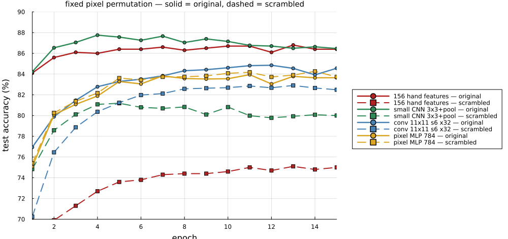
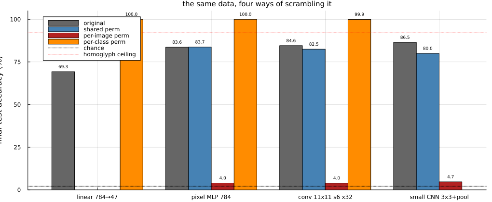
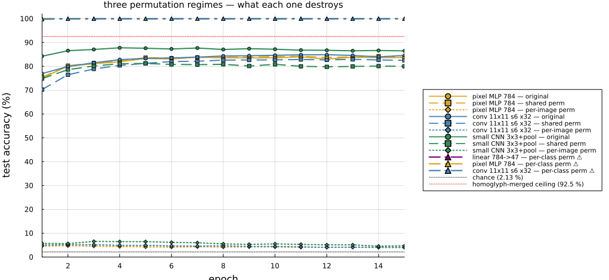

# Hand-designed shape features vs. FPE codes, through a plain MLP on EMNIST

**A self-contained report.** Nothing here assumes you have read any other file in this
repository, or that you already know what Zernike moments, Fractional Power Encoding,
or Vector-Symbolic Architectures are. Every term is defined where it is first used, and
every number quoted was measured by the runs described below.

Date: 2026-07-26. Companion notebooks: `MLPonFeatures.jl` and `ConvComparison.jl`, in this directory.

---

## 1. The question

We had built a **156-number description of a handwritten character** out of two very
different families of shape measurements (§4). Up to this point we had only ever scored
that description with a deliberately weak classifier, which gave 62.5 % on a 47-way
problem. Two questions followed:

1. **How good are these features really**, when scored with a classifier that is
   actually trying — and how do they compare to just handing a network the raw image?
2. **Does it help to re-code the features before classification?** Specifically, does
   embedding each number into a **Fractional Power Encoding** (§6) — the representation
   this whole project is built around — make the information easier or harder for a
   network to use?

The second question matters beyond benchmark numbers. FPE is a way of representing
quantities as vectors so that they can be *combined algebraically* — bound to roles,
superposed, queried. If that representation costs little or nothing in classification
accuracy, it can be adopted freely. If it costs a lot, its algebraic convenience has a
price that has to be justified.

---

## 2. The dataset

**EMNIST-Balanced.** EMNIST is a set of handwritten characters rendered as 28×28
greyscale images, derived from the same source as the classic MNIST digit set but
extended to letters. The *Balanced* variant has **47 classes with equal numbers of
examples each**:

- the 10 digits `0`–`9`,
- the 26 uppercase letters `A`–`Z`,
- 11 lowercase letters `a b d e f g h n q r t`.

Only 11 lowercase letters appear because the dataset's designers merged every
upper/lower pair whose handwritten forms are essentially identical (`C`/`c`, `O`/`o`,
`S`/`s`, …). The 11 that survive as separate classes are exactly those whose lowercase
shape genuinely differs from the uppercase one.

**Official split**, used here exactly as published so the numbers are comparable to
other people's:

| | images | per class |
|:--|--:|--:|
| train | 112,800 | 2,400 |
| test | 18,800 | 400 |

**Chance accuracy is 1/47 = 2.13 %.**

For context on what "good" means on this dataset: published *convolutional* networks
reach roughly **91 %**; published *non-convolutional* multilayer perceptrons on the raw
pixels land around **84–85 %**; the linear baseline in the original EMNIST paper is
about **78 %**.

**Statistical resolution.** With 18,800 test images at ~86 % accuracy, the standard
error on any single accuracy figure is `√(0.86 × 0.14 / 18800) ≈ 0.25 %`. **Differences
smaller than about 0.5 percentage points are not meaningful.** This matters repeatedly
below.

---

## 3. Image preprocessing

Every 28×28 image is **bilinearly upsampled to 112×112** before feature extraction.
This is not for extra information — there is none to add — but because the feature
extractors below place analysis windows and discs at sub-pixel positions, and a 28×28
grid is too coarse for that to be stable. At 112×112 a typical pen stroke is about
**13 pixels wide**, which is the natural length scale for everything that follows.

---

## 4. The 156 features

The description is the concatenation of two blocks that measure genuinely different
things. Both are hand-designed: no learning is involved in producing them.

### 4.1 Block Z — global Zernike moments (75 numbers)

**What Zernike polynomials are.** They are a family of functions defined on a unit disc
(a circle of radius 1), which are *orthogonal* over that disc — meaning each one
measures a pattern of variation that none of the others can express. Each is indexed by
two integers:

```
V_nm(ρ, θ) = R_n^{|m|}(ρ) · e^{imθ}       for ρ ≤ 1,  n ≥ 0,  |m| ≤ n,  n − |m| even
```

where `ρ` is distance from the disc centre (0 at the centre, 1 at the rim) and `θ` is
the angle around the disc.

- **`m` is the angular index** — how the pattern varies as you go *around* the disc.
  `m = 0` means rotationally symmetric (a bullseye); `m = 2` means two-lobed (like a
  bar); `m = 4` means four-lobed (like a cross).
- **`n` is the radial index** — how much structure there is going *outward* from centre
  to rim. `R_n^{|m|}(ρ)` is a polynomial in `ρ`, and larger `n` means more rings.

**The moments.** Projecting the image `f` onto each polynomial gives one complex number:

```
A_nm = (n+1)/π · ∫∫_{ρ≤1}  f(ρ,θ) · R_n^{|m|}(ρ) · e^{−imθ}  dA
```

`A_nm` says "how much of this pattern is present in the character". Because the image
is real-valued, `A_{n,−m}` is just the complex conjugate of `A_nm`, so only `m ≥ 0`
carries new information. Keeping all orders up to **`n ≤ 8`** gives **25 moments**.

**The key property.** If you rotate the character by an angle `α`, every moment simply
picks up a phase: `A_nm → A_nm · e^{−imα}`. So the **magnitude `|A_nm|` is unchanged by
rotation** — it is a rotation-invariant shape measurement — while the **phase carries
the orientation**. We keep both, because for upright letters the orientation is
informative (an `M` and a `W` differ by rotation, and we want to tell them apart).

**The 75 numbers** are therefore `|A_nm|`, `Re A_nm` and `Im A_nm` for the 25 moments.

**Fitting the disc.** Zernike polynomials only exist on the unit disc, so the character
must be placed inside one. We do this by finding the centre of mass of the ink and
scaling so that the 98th percentile of ink radii lands on the rim. (The 98th percentile
rather than the maximum, so that a single stray speck cannot shrink the whole letter.)
This matters: an unfitted disc wastes most of the basis describing empty corners.

**The DC term.** Before taking moments we subtract the mean intensity inside the disc,
which zeroes `A_00`. This makes every remaining moment a statement about *structure*
rather than about how much ink there is. (Because of the orthogonality, adding a
constant to the image only affects `A_00` and nothing else.)

### 4.2 Block F — the "tic-tac-toe" Fourier grid (81 numbers)

Where block Z describes the character as one centred whole, block F describes **where
things are**. The 112×112 image is divided into a **3×3 grid of cells** — hence
"tic-tac-toe" — and each of the 9 cells is described by 9 numbers, giving 81.

Within a cell we take a **windowed 2D Fourier transform**. Concretely: multiply the
cell by a smooth Gaussian window (so the cell's edges don't create artefacts), and
compute the Fourier coefficients `F(v,u)` for the low orders `|v|, |u| ≤ 3`. Each
coefficient corresponds to a plane wave across the cell: `u` counts how many cycles fit
horizontally, `v` vertically. A coefficient's magnitude says how much of that wave is
present.

The useful fact is that **a straight stroke puts its energy along a line in the `(v,u)`
plane perpendicular to the stroke**. So rather than keep the raw coefficients, we
summarise the pattern of energy:

| feature | what it is | what it means |
|:--|:--|:--|
| `a₀` | the `F(0,0)` coefficient | how much **ink** is in this cell |
| `ac` | `√Σ\|F\|²` over all non-zero orders | how much **structure** is in this cell |
| `Re E₂`, `Im E₂` | `E₂ = Σ\|F\|² e^{2iθ} / Σ\|F\|²`, where `θ` is the direction of each coefficient in the `(v,u)` plane | the **orientation** of the dominant stroke, encoded as a 2-vector |
| `\|E₂\|` | magnitude of the above | **how oriented** the cell is: ~0.5 for one clean stroke, 0.0 for a crossing or a blob |
| `\|E₄\|` | the same construction with `e^{4iθ}` | intended to detect two strokes at ~90°; measured to work poorly |
| `e₁, e₂, e₃` | fraction of energy at radius 1, 2, 3 in the `(v,u)` plane | the **radial profile** — coarse vs. fine structure in the cell |

`E₂` deserves a note because the same idea recurs later. Orientation is a quantity that
repeats every 180°, not 360° (a stroke at 10° and a stroke at 190° are the same stroke).
Multiplying the angle by 2 inside the exponential is what makes the code respect that:
`e^{2iθ}` gives the same value for `θ` and `θ+180°`. `|E₂|` then measures how
concentrated the energy is in one direction, and `arg(E₂)/2` recovers the direction
itself.

### 4.3 Why two blocks

Block Z is **rotation-aware and centred**: it describes the character as one object
about its own centre, and knows nothing about where any part of it sits. Block F is
**translation-aware and local**: it knows exactly which ninth of the image each
measurement came from, but each cell's measurement is insensitive to where within that
cell the ink lies. They are, by construction, blind in different directions.

---

## 5. The classifier

A **multilayer perceptron (MLP)** — the plainest kind of neural network. Every unit in
each layer is connected to every unit in the next, with no convolution, no weight
sharing, no spatial structure of any kind. The network is simply given a vector of
numbers and asked to output one of 47 class scores.

Architecture and training, held identical across every condition:

| | |
|:--|:--|
| hidden layers | **1 layer of 256 ReLU units** (justified in §7.1) |
| output | linear layer to 47 class scores |
| loss | softmax cross-entropy |
| optimiser | Adam, learning rate 1e-3 |
| batch size | 128 |
| epochs | 15 |
| framework | Flux.jl 0.16.10 |

Inputs are **standardised** (each feature shifted and scaled to zero mean and unit
variance using *training-set* statistics only) and clipped to ±3 standard deviations.
Standardising with training statistics and applying them unchanged to the test set is
what keeps the evaluation honest.

We report **two numbers** per run: the accuracy at the final epoch, and the best
accuracy reached at any epoch. When these diverge, the network is overfitting late in
training, and the gap is itself informative.

---

## 6. Fractional Power Encoding, and the three input codings

### 6.1 What FPE is

Fractional Power Encoding is a way of turning a **number** into a **vector**, such that
similar numbers get similar vectors and the vectors can be combined algebraically.

Pick a set of `d` random frequencies `θ_1 … θ_d`. Encode the number `x` as the vector
whose `k`-th component is `e^{i θ_k x}` — a unit complex number whose phase advances at
rate `θ_k` as `x` grows. Written as real numbers, that is the pair
`[cos(θ_k x), sin(θ_k x)]` for each `k`.

Why "fractional power": if you call the vector for `x = 1` the base `z`, then the vector
for any `x` is `z` raised to the power `x`, with fractional powers perfectly
well-defined because raising a unit complex number to a fractional power just scales its
phase.

The essential property is the **similarity kernel**. The inner product between the codes
of two numbers depends only on their difference, and if the frequencies are drawn from a
Gaussian with standard deviation `σφ`:

```
⟨ V(x), V(y) ⟩  ≈  exp( −σφ² (x−y)² / 2 )
```

So **`σφ` is an inverse similarity width**. Small `σφ` → a broad, smooth code where
numbers far apart still look similar. Large `σφ` → a sharp, high-resolution code where
only very close numbers look alike. Since our features are standardised, `σφ` is in
units of "radians of phase per standard deviation of the feature".

**Two more VSA operations** are needed for the third coding below:

- **Binding** — combining two vectors by elementwise multiplication (`⊙`). Binding a
  value code to a random **role vector** `R_j` tags it as "this is feature *j*'s value".
  Binding is invertible: multiplying by the conjugate of `R_j` recovers the value code.
- **Bundling** — superposing several vectors by *adding* them. The sum is similar to
  each of its parts, so one vector can hold many items at once — but the parts interfere,
  and the interference grows with how many you pack in.

### 6.2 The three codings compared

Take the 156 standardised feature values `x_1 … x_156` of one character.

**(a) RAW.** Feed the 156 numbers to the network directly. **156 inputs.**

**(b) CONCAT-FPE.** Give each feature its own FPE code and lay them end to end:

```
input = [ V_1 | V_2 | … | V_156 ]     where V_j = [cos(θ_jk x_j), sin(θ_jk x_j)]_k
```

Here **`d_feat`** is the number of real numbers spent on **one** feature — it is
`d_feat/2` frequencies, each contributing a cosine and a sine. The total input width is
`156 × d_feat`, so `d_feat = 8` gives **1,248 inputs** and `d_feat = 32` gives
**4,992 inputs**.

This coding is mathematically identical to **random Fourier features**, a standard trick
for approximating a kernel machine: `d_feat/2` is the number of Monte-Carlo samples used
to approximate the Gaussian kernel of width `1/σφ`. It tests whether a fixed nonlinear
expansion of each input helps the network.

**(c) BUNDLE-FPE.** The Vector-Symbolic coding. Bind each feature's value code to that
feature's role vector, and superpose everything into **one** vector:

```
V = (1/√156) · Σ_j  R_j ⊙ z_j^{x_j}
```

fed to the network as `[Re V, Im V]`. Here **`D`** is the width of that single vector,
so the input is **`2D` numbers regardless of how many features there are** — `D = 256`
gives **512 inputs** for all 156 features. That fixed width is the entire point of the
representation: it composes.

The cost is interference. Recovering one item from a bundle of `N` gives signal 1
against crosstalk of roughly `√(N/D)`. With `N = 156`, that is 0.78 at `D = 256` and
0.28 at `D = 2048`.

> **Note on notation.** `d_feat` (concat) and `D` (bundle) are *not comparable numbers*.
> `d_feat` is per-feature; `D` is the total for all features. Concat at `d_feat = 32`
> uses 4,992 inputs; bundle at `D = 256` uses 512.

### 6.3 The unbinding diagnostic

If the bundle coding underperforms, there are two quite different possible reasons:
the superposition destroyed the information, or the information is present but gradient
descent failed to find it. To tell these apart we test recoverability directly, with no
learning involved:

1. build the bundle `V`;
2. unbind feature `j` analytically: `u_j = V ⊙ conj(R_j)`, which yields `z_j^{x_j}` plus
   crosstalk from the other 155 features;
3. decode the value by correlating `u_j` against the code for every candidate value on a
   grid and taking the best match;
4. score the recovered value against the true one with **R²** (1.0 = perfect recovery,
   0.0 = no better than always guessing the mean, negative = worse than that).

---

## 7. Results

All figures are accuracy on the **official 18,800-image test set**, 47 classes,
chance 2.13 %. Format: *final epoch / best epoch*. Recall that **±0.5 % is the
resolution limit**.

### 7.1 How deep does the network need to be?

Measured on the raw 156 features at 30 epochs:

| hidden layers | final | best |
|:--|--:|--:|
| 256 | **85.87 %** | 86.76 % |
| 512 | 85.56 % | 86.63 % |
| 512, 512 | 85.29 % | 86.68 % |
| 512, 512, 512 | 85.03 % | 86.61 % |

**Depth does not help at all.** Every configuration peaks at essentially the same place
(86.6–86.8 %), and the final-epoch number gets *worse* with depth purely because deeper
networks overfit more in the last epochs. All subsequent experiments therefore use **one
hidden layer of 256 units**, which is also the fastest. Separately, 15 epochs gave a
better final accuracy than 30 (86.43 % vs 85.87 %), so 15 epochs is used throughout.

The interpretation is that the features have already done the hard nonlinear work. What
remains for the network is close to a linear separation, and extra capacity only buys
extra overfitting.

### 7.2 Reference points

| input | numbers | final | best |
|:--|--:|--:|--:|
| **raw 156 features** | 156 | **86.43 %** | 86.71 % |
| raw 784 pixels | 784 | 83.65 % | 83.95 % |
| block Z alone (Zernike) | 75 | 83.96 %\* | 84.27 %\* |
| block F alone (Fourier grid) | 81 | 85.86 %\* | 86.32 %\* |

<sub>\* measured at 30 epochs</sub>

**Three findings.**

**(i) The 156 features beat the 784 raw pixels by 2.8 points** under an identical
network. This is the headline result. The features are a 5× smaller representation, and
yet they are *more* useful — so they are not a lossy compression of the image but a
genuine re-description that exposes structure a fully-connected network cannot easily
find for itself. (A convolutional network would find much of it, which is why
convolutional EMNIST results are higher; the comparison here is like-for-like against a
network with no spatial prior.)

**(ii) A weak classifier badly understated these features.** The same 156 numbers scored
**62.5 %** under leave-one-out nearest-class-mean — a classifier that represents each
class by its average feature vector and assigns each item to the nearest one. The MLP
gets **86.4 %** from identical inputs. That 24-point gap is entirely the classifier.
Nearest-class-mean weights every feature equally and assumes classes are blobs around
their means; when neither holds, it reports a floor, not a measurement.

**(iii) A conclusion we had drawn earlier does not survive.** Under nearest-class-mean,
combining blocks Z and F was worth **+6.4 points** over either alone, and we had
interpreted that as strong evidence of complementarity. Under the MLP, block F alone
gets **85.86 %** and Z+F gets **86.43 %** — a 0.6-point difference, at the edge of
significance, and block Z contributes almost nothing on top of F. The complementarity
was largely an artefact of the weak classifier's inability to exploit F's features on
its own, not a property of the representations. This is recorded here because it
corrects the earlier claim.

### 7.2b One convolution layer, for comparison

Everything above uses a network with **no convolution at all**. Since convolution is the
standard tool for images, a matched convolutional row was added afterwards
(`ConvComparison.jl`, in this directory):

```
28×28 image → Conv 11×11, stride 6, 32 kernels, ReLU → 3×3×32 = 288 → Dense 256 ReLU → 47
```

One convolution layer: 32 learnable 11×11 kernels slid with stride 6, so consecutive
placements overlap by about half. On a 28×28 image that gives a **3×3 grid of
positions** — deliberately, because that is a *learned* counterpart of the hand-designed
3×3 "tic-tac-toe" grid of §4.2, with 32 learned kernels per cell instead of 9 designed
Fourier numbers. Everything after the convolution — head, optimiser, batch size, epochs —
is identical to every other arm. All three rows were run in one session:

| arm | features into the head | total params | final | best |
|:--|--:|--:|--:|--:|
| **conv 11×11, stride 6, 32 kernels** | 288 | 89,967 | **84.56 %** | 84.85 % |
| pixels 784, no convolution | 784 | 213,551 | 83.65 % | 83.95 % |
| **156 hand-designed features** | 156 | 52,271 | **86.43 %** | 86.71 % |

**Convolution helps over raw pixels, but only by ~0.9 points** (3.6 standard errors) —
a single stride-6 layer with a 3×3 output is a weak convolutional model, with no pooling,
no second stage and little translation robustness.

**The hand-designed features still win by 1.9 points** (7.5 standard errors), using
**156 numbers against 288** and **52 k parameters against 90 k**. The comparison is
close to apples-to-apples — both descriptions impose a 3×3 spatial layout and hand the
classifier a per-cell summary; only the origin of the summaries differs. What the
designed features have that one 11×11 kernel cannot express is explicit **scale and
invariance structure**: the Zernike block describes the character as a centred whole with
known rotation behaviour, and the Fourier block's per-cell orientation tensor is built to
be translation-invariant *within* each cell. A single convolution has to discover any
such structure from data, from 9 spatial positions, with no depth to build it in.

**This is a floor for convolution, not a ceiling.** A second layer, pooling, or more
kernels would likely close and reverse the gap — that is what the ≈ 91 % published
convolutional results are. The narrow claim is: *at matched depth, head and training
budget*, the designed features beat a single learned convolution layer. That says the
features carry real structure; it does not say convolution is inferior.

### 7.3 CONCAT-FPE: giving each feature its own code

| `σφ` | `d_feat` = 8 (1,248 inputs) | `d_feat` = 32 (4,992 inputs) |
|--:|--:|--:|
| 0.5 | **85.58 %** / 85.68 | 84.72 % / 84.78 |
| 1.0 | 85.11 % / 85.47 | 84.27 % / 84.77 |
| 2.0 | 82.94 % / 84.22 | 82.30 % / 83.73 |

**Every cell is below the 86.43 % raw baseline, and accuracy falls monotonically in both
directions** — the more code dimensions, and the sharper the kernel, the worse it gets.
The best cell is the one that least resembles an FPE code at all: the narrowest
bandwidth and the smallest code, i.e. the setting closest to just passing the number
through.

This is a clean negative result, and in hindsight it is the expected one.

To be precise about what the encoding does: the scalar is **not** replaced by anything
random. It is re-expressed through a bank of sinusoids whose *frequencies* were drawn at
random but are then fixed — `x_j ↦ [cos(θ_jk x_j), sin(θ_jk x_j)]_k` is a deterministic,
one-to-one map of the scalar onto a curve in `d_feat` dimensions. No information about
`x_j` is thrown away by the map itself.

What *is* given up is the **form in which the information is presented to the first
layer**, and there are two concrete costs:

- **A linear dependence on a feature stops being expressible in one weight.** In the raw
  coding the first layer computes `w · x`, so "this class tends to have a large value of
  feature `j`" costs exactly one parameter and is exactly linear in `x_j`. In the FPE
  coding, any function of `x_j` must be synthesised as a sum of sinusoids,
  `Σ_k (a_k cos θ_jk x_j + b_k sin θ_jk x_j)` — a random-frequency trigonometric
  polynomial. That can approximate a great many functions, but a simple ramp in `x_j` now
  needs many coefficients cancelling against each other rather than one weight.
- **Similarity saturates, so long-range magnitude information is discarded.** The
  induced kernel `exp(−σφ²(x−y)²/2)` falls to ~0 once `|x−y|` exceeds a few `1/σφ`. Beyond
  that range *all* pairs of values look equally dissimilar: the code can no longer
  distinguish "somewhat above average" from "far above average". The raw scalar carries
  that distinction for free.

Both costs get worse in exactly the directions the measurements move: larger `σφ` shrinks
the range over which values remain comparable, and larger `d_feat` multiplies the
parameters needed to synthesise a given dependence — which is what the table shows,
monotonically in both.

The underlying point is that random Fourier features are valuable when you need a *fixed*
nonlinear expansion because your model cannot learn one — a kernel machine, or a linear
readout. An MLP's first layer already *is* a learned nonlinear expansion. Supplying a
random one in front of it adds nothing the network could not have learned, while costing
it direct linear access to each feature and handing it 8–32× more parameters to overfit
with. The encoding is solving a problem this model does not have.

### 7.4 BUNDLE-FPE: the Vector-Symbolic coding

Column headers give the bundle width `D` and, in brackets, the resulting number of
**inputs to the network** — which is `2D`, because the bundle is a complex vector fed in
as its real and imaginary parts. Unlike the concat table, this does not grow with the
number of features: all 156 are superposed into the same `D`.

| `σφ` | `D`=256 (512 inputs) | `D`=512 (1,024 inputs) | `D`=1024 (2,048 inputs) | `D`=2048 (4,096 inputs) |
|--:|--:|--:|--:|--:|
| 0.5 | 85.63 % / 85.75 | 85.75 % / 85.75 | **85.79 %** / 85.79 | 84.00 % / 85.04 |
| 1.0 | 84.98 % / 85.15 | 84.98 % / 85.14 | 85.00 % / 85.37 | 84.21 % / 84.63 |
| 2.0 | 81.85 % / 82.74 | 82.43 % / 83.64 | 82.59 % / 84.14 | 82.50 % / 83.38 |

**The headline is how cheap bundling is.** At `σφ = 0.5` the bundle reaches **85.79 %**
against raw's 86.43 % — a **0.6-point cost**, which is barely more than the measurement
resolution. All 156 features, superposed into a single vector of 1,024 numbers with
their role tags, cost essentially nothing in accuracy.

Two structural observations:

- **Accuracy is flat in `D` from 256 to 1024** (85.63 → 85.75 → 85.79 at `σφ=0.5`), then
  *drops* at `D = 2048`. The drop is overfitting, not information loss: the final-vs-best
  gap widens sharply there (84.00 vs 85.04) as the first layer grows past a million
  parameters, while the recoverability of the information is still *increasing* (§7.5).
- **Narrow bandwidth wins**, consistently, at every width: `σφ = 0.5` > `1.0` > `2.0`.

### 7.5 What survives superposition: the unbinding diagnostic

Median R² of recovering the 156 individual feature values from the bundle, by analytic
unbinding and matched-filter decoding — **no learning involved**:

| `D` | 128 | 256 | 512 | 1024 | 2048 | 4096 |
|:--|--:|--:|--:|--:|--:|--:|
| `σφ` = 0.5 | −1.19 | −0.31 | 0.37 | 0.75 | 0.88 | 0.94 |
| `σφ` = 1.0 | −1.36 | −0.17 | 0.56 | 0.90 | 0.96 | 0.98 |
| `σφ` = 2.0 | −1.38 | −0.48 | 0.32 | 0.86 | 0.99 | 1.00 |
| `√(D/156)` | 0.91 | 1.28 | 1.81 | 2.56 | 3.62 | 5.12 |

This behaves exactly as superposition theory predicts. Below `D ≈ N = 156` the R² is
**negative** — the recovered values are worse than simply guessing the mean, because
crosstalk from the other 155 items exceeds the signal. Recovery then climbs steadily
with width, reaching near-perfect only around `D = 4096`.

The bandwidth optimum **moves with width**: `σφ = 1` is best at `D` = 512–1024, `σφ = 2`
is best at 2048–4096. Bandwidth buys resolution, width buys capacity, and you can only
afford resolution once you have capacity — pushing `σφ = 2` at `D = 512` costs you
(0.32 vs 0.56) because the code is finer than the dimensionality can support.

### 7.6 The most interesting result: recovery and classification come apart

Put §7.4 and §7.5 side by side at `σφ = 0.5`:

| `D` | 256 | 512 | 1024 | 2048 |
|:--|--:|--:|--:|--:|
| **decode R²** (can you get the numbers back?) | **−0.31** | 0.37 | 0.75 | 0.88 |
| **classification** (can you tell the letter?) | **85.63 %** | 85.75 % | 85.79 % | 84.00 % |

At `D = 256` the individual feature values are **unrecoverable** — R² is negative, the
decoder does worse than guessing — and yet the network classifies at **85.63 %**, within
a point of having the clean features. Across the whole range, decode R² moves from
*negative* to 0.75 while accuracy moves by 0.16 points.

**These two capacities are close to unrelated, and conflating them would be a mistake.**
The reason is that classification never requires inverting the superposition. The
decoder is solving a hard problem — recover 156 specific values exactly — whereas the
network only needs to find directions in the bundle along which the 47 classes separate.
Those directions are linear combinations of many features at once, they are numerous,
and they survive levels of crosstalk that destroy per-item recovery.

The practical consequence for this project is concrete: **the `√(D/N)` capacity rule is
the right yardstick for retrieval and the wrong one for classification.** Sizing a
bundle so that its contents can be read back item-by-item is the correct discipline when
you intend to query it symbolically. If the bundle is only ever going to be consumed by
a downstream discriminative readout, that rule over-provisions the width by roughly an
order of magnitude — here, `D = 256` classifies as well as `D = 1024`, while needing
`D ≈ 4096` for faithful readback.

---

## 7.7 Why does everything stop at ~86 %?

Every arm above lands between 82 % and 86.5 %, whichever representation is used, and
even a 16-kernel convolution is only a couple of points behind a 32-kernel one. That
clustering demanded an explanation, so three further diagnostics were run
(`CeilingDiagnostics.jl`). The answer is mostly **the dataset**, not the models.

| model | strict | homoglyphs merged | gain | share of errors |
|:--|--:|--:|--:|--:|
| **156 hand features** | **86.43 %** | **92.53 %** | +6.10 | 45 % |
| **small CNN** (2 conv, stride 1, pooling) | 86.46 % | **92.70 %** | +6.24 | 46 % |
| conv 11×11 s6 ×32, learned | 84.56 % | 90.80 % | +6.23 | 40 % |
| pixels 784, no conv | 83.65 % | 89.91 % | +6.26 | 38 % |
| conv ×64, frozen random | 80.48 % | 86.71 % | +6.23 | 32 % |
| conv ×32, frozen random | 78.62 % | 84.88 % | +6.27 | 29 % |
| conv ×16, frozen random | 73.19 % | 79.55 % | +6.36 | 24 % |
| conv ×8, frozen random | 63.44 % | 69.82 % | +6.38 | 17 % |

"Merged" treats each of `0`/`O`, `1`/`I`/`L`, `2`/`Z`, `5`/`S`, `9`/`g`/`q` as a single
class — characters that are genuinely the **same handwritten shape**, where the label
asks for a distinction the ink does not contain.

**(i) Nearly half the best model's error is undecidable labels.** Merging lifts the
feature arm from **86.43 % to 92.53 %**: 45 % of what remained was homoglyph confusion.

**(ii) The homoglyph error is the same absolute size for every model.** Look down the
`gain` column: **+6.10 to +6.38** across models spanning **63 % to 86 %** accuracy, four
architectures, learned and frozen alike. A model at 63 % makes as many `0`-vs-`O`
mistakes as one at 86 %. That is what a genuine task ceiling looks like — every model
fails on the *same* images, and improving a model only reduces the other kind of error.
It also explains the clustering directly: once the decidable error is mostly gone,
everything sits just above a shared ~6.2-point floor.

**(iii) The convolution really is learning — a prediction of mine that was wrong.** I
expected freezing the kernels at random initialisation to cost little, on the
random-features argument that a strong head compensates for an arbitrary basis, and that
this would explain why the filters look unstructured. Measured: learned-32 reaches
**84.56 %** against frozen-random-32's **78.62 %**, and frozen-random is still below
learned-32 even at 64 kernels (80.48 %). Learning the kernels is worth ~6 points. The
filters are unstructured *to the eye* but functionally doing real work; they never
resemble textbook edge detectors because with stride 6 there are only 9 positions per
image, no pooling to reward translation tolerance, and no second convolution that would
need clean oriented edges as its input.

**(iv) A proper CNN buys ~1.3 points, not the 5 I guessed.** A conventional stride-1 CNN
with max-pooling reaches **87.76 % at its best epoch** and 86.46 % at epoch 15 — against
the features' 86.43 %. The final-epoch figures are *statistically identical* (0.03 apart
against a 0.25 % standard error). It converges very fast (84.22 % after one epoch, peak
at epoch 4) then drifts down: ordinary overfitting on a 15-epoch budget with no
augmentation or schedule. Published ≈ 91 % convolutional results are not contradicted —
they need exactly the machinery excluded here to keep the arms comparable. What this
establishes is narrower: **the ~86 % plateau is not an artefact of avoiding convolution.**

**Taken together:** of the ~13.6 % error the best model makes, roughly **6.2 points are
undecidable** and only ~7.4 points are addressable at all. Within that margin, four quite
different representations span barely 3 points. The features look good less because they
approach some limit of shape description than because the task leaves little room to
separate good descriptions from very good ones.

**Practical consequence.** For comparing *representations*, this dataset is close to
exhausted. Quote the homoglyph-merged number, which has more headroom and is less
dominated by the floor — or move to a task whose labels are decidable from the ink.

## 7.8 Scrambling the pixels: how much of this is the geometry?

A sharper way to ask what the features are worth. Draw **one fixed random permutation of
the 784 pixel positions** and apply **the same map to every training and test image**,
before any feature extraction. This is a **bijection** — no information is destroyed and
the images remain perfectly classifiable in principle. The only thing lost is **spatial
adjacency**: pixels that were neighbours are scattered.

Each architecture then reveals how much it was relying on that adjacency. Full official
split, 15 epochs, permutation seed 42; both notebooks have this on a checkbox.



| arm | original | scrambled | cost | edge over pixel MLP: before → after |
|:--|--:|--:|--:|:--|
| **156 hand features** | 86.44 % | **74.95 %** | **−11.5** | +2.79 → **−8.78** |
| small CNN (3×3 stride 1 + max-pool) | 86.46 % | 80.00 % | **−6.5** | +2.81 → **−3.73** |
| conv 11×11 stride 6 ×32 | 84.56 % | 82.49 % | **−2.1** | +0.91 → **−1.24** |
| pixels 784, no convolution | 83.65 % | 83.73 % | **0.0** | — |

### (i) The pixel MLP is exactly unaffected — and this is provable, not lucky

Its first layer computes `Wx`. Permuting the input by `P` gives `W(Px) = (WP)x`, and
since `W` is initialised i.i.d., `WP` has exactly the same distribution as `W`. The model
class is **exactly equivariant** to input permutation, so only seed noise can move.
Measured: 83.65 % → 83.73 %, and the two curves lie on top of each other at *every*
epoch (0.751/0.754, 0.801/0.803, 0.811/0.814, …), which is what makes it convincing
rather than coincidental.

### (ii) The cost column is a ladder, ordered by how much locality is actually used

The small CNN applies its first kernel at **784 positions** and pools 2×2
neighbourhoods, so scrambling costs it **three times** what it costs the 11×11 stride-6
arm, which has only **9 positions** and therefore barely exploits weight sharing at all.

That retro-explains two earlier observations that looked odd in isolation (§7.7): the
11×11 arm's learned kernels look visually unstructured, and learned-32 beat
*frozen-random*-32 by only ~6 points. That arm is closer to a structured random
projection than to a real convnet, and the permutation test is what exposes it.

### (iii) In every convolutional case the prior flips sign

Look at the last column. On scrambled pixels **both convnets end up worse than the plain
MLP on the same data**. The convolutional inductive bias is not merely neutralised — it
becomes an **active handicap**, because the network spends capacity enforcing a
constraint that is now false. That is the "destruction" one expects; it simply does not
appear as a collapse toward chance.

### (iv) Nothing collapses to chance, for a reason worth understanding

Weight sharing constrains the *parameterisation*; it does not make the outputs redundant.
Position `p` reads a fixed coordinate set `S_p`, and applying the **same** `w_k` to
**different** `S_p` yields genuinely different linear functionals. So 288 distinct
projections exist regardless of whether any repeating feature does — and a
74 k-parameter head on 288 ReLU features is a strong classifier whatever the projection
is. This is the same reason a *frozen random* convolution scores 78.6 % (§7.7).

The identical argument explains the hand features' floor. **A Zernike moment is a linear
functional of the image**: `A_nm = Σ_pixels f(pixel)·basis(pixel)`. Permute the pixels and
you get a *different* linear functional — still a linear projection. So the scrambled
features are 156 fixed nonlinear features built on fixed linear projections: precisely a
random-feature extractor. That predicts the number quantitatively — 288 frozen random
outputs give 78.6 %, these 156 outputs give 75.0 %.

Per block, scrambled: Zernike alone **69.3 %**, Fourier alone **68.7 %**, per-cell ink
`a₀` alone **33.7 %**. So the survivor is emphatically *not* a regional ink census — ink
is the weakest part. It is the moments acting as generic projections.

### (v) The headline: designed geometry is worth ~5× a coarse convolution

**−11.5 points for the hand features against −2.1 for the 11×11 convolution**, and −6.5
for a proper CNN. The features lose most because they are the only arm that **cannot
adapt**: the convnets simply re-learn kernels suited to scrambled data, and the MLP is
equivariant, but Zernike and Fourier are frozen in a geometry that no longer exists and
the head can only re-weight them.

This is a much sharper statement of §7.2b's finding than "the features beat a
convolution by 1.9 points". It says *how much real spatial structure each encodes*.

### (vi) What the curves add over the endpoints

Every scrambled run **starts lower and climbs more slowly** — the scrambled 11×11 conv
starts at 70 % against 77 %. So part of the cost is **optimisation difficulty**, not
purely a representational limit, and a longer budget would likely close some of it. But
the hand features' scrambled curve **plateaus flat by epoch 8** and stays there, whereas
the convnets' scrambled curves recover much closer to their originals. That asymmetry —
adaptable versus frozen — is visible in the shapes, not just the final numbers.

## 7.9 Three ways to scramble, and what each one destroys

§7.8 used **one** permutation shared by every image. Two variants isolate what that
shared map was actually providing, and together the three regimes separate three things
that are easy to conflate: *information content*, *a shared coordinate system*, and
*spatial adjacency*.

| regime | what it is | what it destroys |
|:--|:--|:--|
| **shared** | one fixed map, every image | adjacency only |
| **per-image** | a fresh map for every image | adjacency **and** the shared coordinate system |
| **per-class** | one map per class, same for all its instances | adjacency — but **encodes the label in the input** |

All three are bijections on each image, so none removes information from any *individual*
image. Full split, 15 epochs.





| arm | original | shared | per-image | per-class |
|:--|--:|--:|--:|--:|
| linear 784→47 | 69.29 % | — | — | **100.00 %** |
| pixel MLP 784 | 83.65 % | 83.73 % | **4.00 %** | 99.99 % |
| conv 11×11 s6 ×32 | 84.56 % | 82.49 % | **3.97 %** | 99.94 % |
| small CNN 3×3+pool | 86.46 % | 80.00 % | **4.71 %** | — |

*(chance 2.13 %; the homoglyph-merged ceiling from §7.7 is 92.5 %)*

### (i) Per-image scrambling destroys almost everything — 4 %, near chance

Give every image its **own** permutation and all three architectures collapse to
**~4 %**, barely above the 2.13 % floor, and **converge to the same value**. That
convergence is the point: with no shared coordinate system, no architectural prior has
anything left to be right or wrong about, so a CNN, a coarse convolution and a plain MLP
become indistinguishable.

What survives is only what is *permutation-invariant*: total ink and the intensity
histogram. On near-binary EMNIST that is essentially "how much ink", which separates an
`I` from an `M` a little and almost nothing else — hence 4 % rather than 2.13 %.

**This is what makes §7.8 interpretable.** The shared-permutation result (83.7 % for the
MLP) is not evidence that images contain some "non-local" structure that survived
scrambling. It is evidence that **a fixed relabelling of coordinates is just a different,
equally valid coordinate system**, and a large nonlinear model can learn any coordinate
system given enough data — *provided train and test agree on it*. Remove that agreement
and everything goes.

### (ii) Per-class scrambling makes the task trivial — 100 %, and that is a warning

Give each **class** its own permutation and accuracy goes to **100.00 % for a bare
linear classifier**, from epoch 1. No hidden layer, no convolution.

The mechanism is that **the permutation becomes the label**. About half of EMNIST's 784
pixels are background in essentially every image; under `P_c` those always-zero pixels
land on a class-specific set of output positions. The classifier only has to notice
*which* positions are dark, and it never looks at the letter at all. Quantified by the
cosine similarity between class-mean images:

| | mean | max |
|:--|--:|--:|
| original | 0.762 | **0.982** |
| per-class permuted | 0.409 | **0.538** |

The 0.982 in the original data is a pair of classes whose average images are nearly
identical — the homoglyph pair that caps everything in §7.7. After per-class permutation
the *worst* pair sits at 0.538. Nothing about the letters became more distinguishable;
the **coordinate systems** did, and the classifier reads those instead.

**The diagnostic to remember:** 100 % sails past the **92.5 %** homoglyph-merged ceiling.
Since ~45 % of the residual error at 86 % is genuinely undecidable shapes (§7.7), no
honest shape representation can exceed that ceiling. **Exceeding it is proof of leakage,
not of a better model.** This is the same failure mode as a dataset where each class was
photographed with a different camera.

### (iii) The methodological rule

A permutation test is informative only when the permutation is **independent of the
label**. Shared and per-image both are, and both teach something. Per-class is not — it
changes the task rather than probing the model, and the ~100 % it produces measures
nothing about representation quality.

## 8. Summary of conclusions

1. **The 156 hand-designed features are genuinely good**: 86.4 % on 47-way EMNIST,
   beating a 784-pixel raw-image MLP (83.7 %) trained identically, at a fifth the size —
   and also beating a matched single convolution layer (84.6 %) that gets 288 learned
   features and 1.7× the parameters.
2. **They are shallow-friendly.** One hidden layer of 256 units is as good as three of
   512; the features have already done the nonlinear work.
3. **Weak classifiers give badly misleading readings.** The same features score 62.5 %
   under leave-one-out nearest-class-mean — 24 points lower — and, worse, that classifier
   produced a *qualitative* conclusion (strong Z+F complementarity) that the MLP shows to
   be an artefact.
4. **Concatenated FPE hurts, monotonically.** It is random Fourier features, which solve
   a problem a learned first layer does not have.
5. **Bundled FPE is nearly free**: 85.8 % against 86.4 %, packing 156 features into a
   single 1,024-number vector with role tags. For a representation whose whole purpose is
   algebraic composability, a 0.6-point cost is a bargain.
6. **Recoverability and discriminability are different capacities.** A bundle too narrow
   for its contents to be read back at all can still be classified almost perfectly.

7. **Most of the remaining error is the dataset, not the models.** Merging the classes
   that are the same handwritten shape lifts the best arm from 86.4 % to **92.5 %** — 45 %
   of its error was undecidable — and the absolute size of that error is **the same
   (+6.1 to +6.4 points) for every model from 63 % to 86 % accuracy**. A conventional
   stride-1 CNN with pooling reaches only 87.8 % at best on the same budget, so the ~86 %
   plateau is a property of EMNIST-Balanced, not of avoiding convolution.
8. **Three scrambling regimes separate three different things** (§7.9). A *shared*
   permutation destroys adjacency only, and the plain MLP is unaffected. A *per-image*
   permutation also destroys the shared coordinate system, and everything collapses to
   **~4 %** — all architectures converging, because no prior has anything left to be
   right about. A *per-class* permutation encodes the label in the input, and a bare
   linear classifier reaches **100 %** — which, by exceeding the 92.5 % undecidability
   ceiling, is a proof of leakage rather than of quality. A permutation test is
   informative only when the permutation is independent of the label.
9. **The features' geometry is worth ~5× a coarse convolution's locality prior.**
   Scrambling the pixels with one fixed permutation costs the hand features **11.5
   points**, a proper CNN **6.5**, the 11×11 stride-6 convolution **2.1**, and the pixel
   MLP **nothing at all** (it is exactly equivariant to input permutation). In both
   convolutional cases the prior *flips sign* — on scrambled pixels the convnets are
   worse than the plain MLP. Nothing falls to chance, because a fixed projection into a
   few hundred dimensions plus a trained head is a strong baseline whatever the
   projection is.

### What this does not show

- Only one classifier family was tried. A convolutional network on raw pixels would beat
  everything here; the pixel arm is a like-for-like control, not an attempt at the state
  of the art.
- Bandwidth and width were swept coarsely (3 × 4 grid), with one random seed per cell.
  Differences below ~0.5 points anywhere in these tables should not be interpreted.
- The bundle used one role vector per feature *type*, with all 156 features always
  present. It does not test the case FPE is really for — variable-length, variable-content
  structures — where the fixed width becomes a genuine advantage rather than a
  constraint the raw coding does not have to satisfy.
- The permutation test (§7.8) uses a single permutation seed. The mechanism is
  deterministic enough that the numbers should be stable, but this was not checked
  across seeds. It is also adversarial to the hand-designed features *by construction*,
  which is the point — it isolates their geometric content — but it is not a claim about
  performance on any realistic input.

---

## 9. Reproducing

`MLPonFeatures.jl` is a Pluto notebook implementing all of the above
with the arms, code sizes and bandwidths on sliders. Feature extraction over the full
131,600 images takes about 105 s; individual training runs range from 12 s (raw
features) to ~20 min (the widest codes).

```bash
cd mother-embedding
julia --project=. -t 4 -e 'using Pluto; Pluto.run(notebook="TestFeaturesWithMLP/MLPonFeatures.jl")'
```

The `-t 4` matters: the FPE encoders are threaded, and are slow without it.

Requirements: Julia 1.11, the project's `Project.toml` environment (Flux 0.16.10 is
included), and the EMNIST-Balanced idx files in `~/Julia/DATABASES/EMNIST/` — the train
split at the top level and the test split in the `emnist_source_files/` subdirectory.
